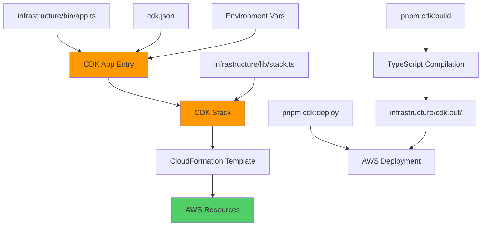
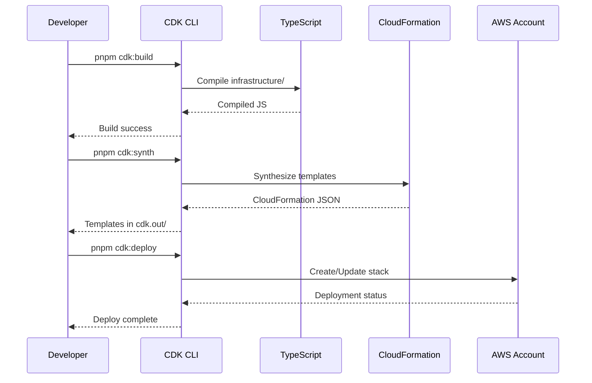
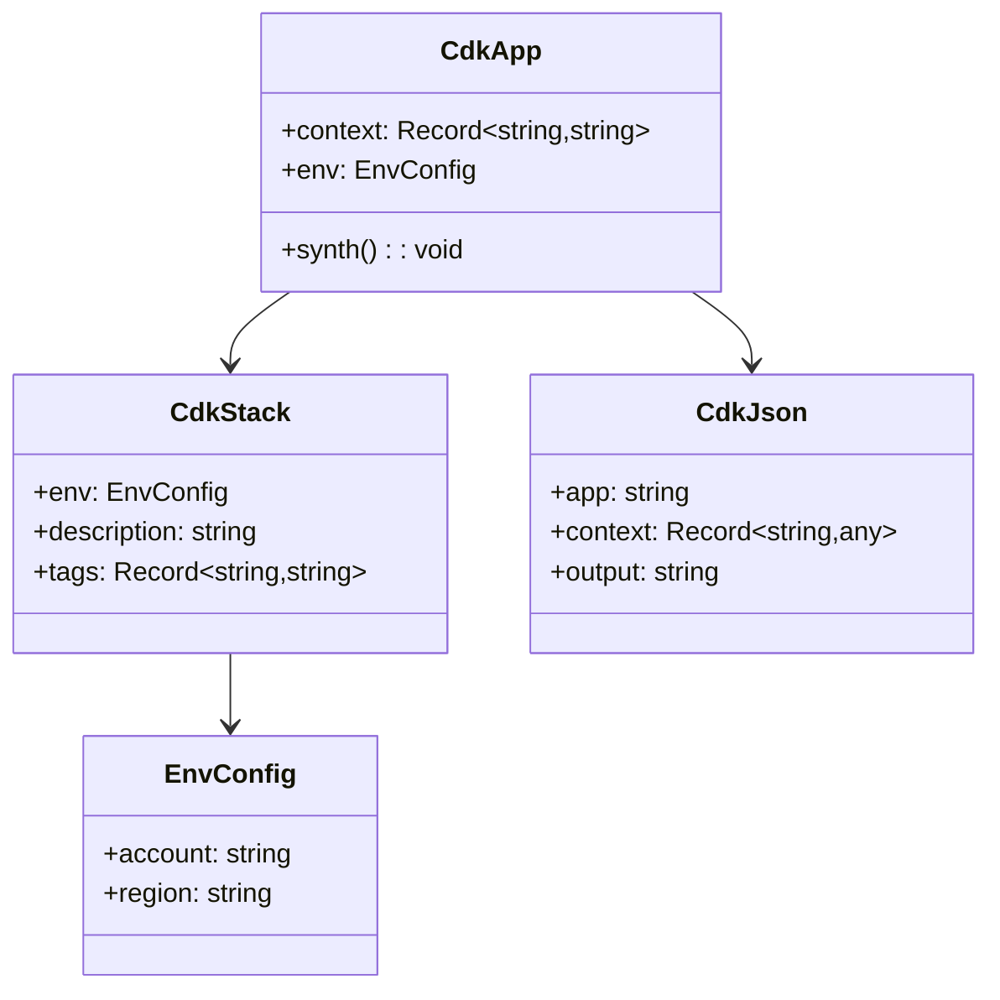

**Component:** AWS CDK Infrastructure Setup

**Project Structure:**
```
project-root/
├── infrastructure/          # CDK project directory
│   ├── bin/
│   │   └── app.ts           # CDK app entry point
│   ├── lib/
│   │   └── stack.ts         # Main CDK stack (empty initially)
│   ├── cdk.json             # CDK configuration
│   └── tsconfig.json        # CDK TypeScript config
├── package.json             # CDK scripts: cdk:build, cdk:deploy, cdk:destroy
└── src/                     # Existing application code (unchanged)
```

**CDK Configuration:**
- **cdk.json:** CDK CLI settings, app entry point, context
- **tsconfig.json:** TypeScript config for CDK (separate or extended)
- **package.json:** CDK dependencies (aws-cdk-lib, constructs), build scripts

**Environment Variables:**
- `CDK_DEFAULT_ACCOUNT`: AWS account ID
- `CDK_DEFAULT_REGION`: AWS region (e.g., us-east-1)
- Environment-specific: dev/staging/prod via context or env vars

**CDK Scripts:**
- `cdk:build`: Compile CDK TypeScript
- `cdk:synth`: Synthesize CloudFormation templates
- `cdk:deploy`: Deploy stack to AWS
- `cdk:destroy`: Remove stack from AWS
- `cdk:diff`: Show differences between deployed and local

**TypeScript Interfaces:**
```typescript
// CDK App Configuration
interface CdkAppConfig {
  readonly context: Record<string, string>;
  readonly env?: {
    readonly account?: string;
    readonly region?: string;
  };
}

// Stack Configuration
interface StackConfig {
  readonly env?: {
    readonly account: string;
    readonly region: string;
  };
  readonly description?: string;
  readonly tags?: Record<string, string>;
}
```

**Integration Points:**
- **pnpm workspace:** CDK code in `infrastructure/` uses same pnpm workspace
- **TypeScript:** CDK uses separate/extended tsconfig.json
- **Build:** CDK compiles independently, outputs to `infrastructure/cdk.out/`
- **Deploy:** CDK deploys to AWS, Vercel deploys serverless functions separately

**Diagrams:**







**Dependencies:**
- **aws-cdk-lib:** CDK v2 core library
- **constructs:** CDK construct base classes
- **@types/node:** Node.js type definitions
- **TypeScript:** Compiler for CDK code

**Story:** #16
