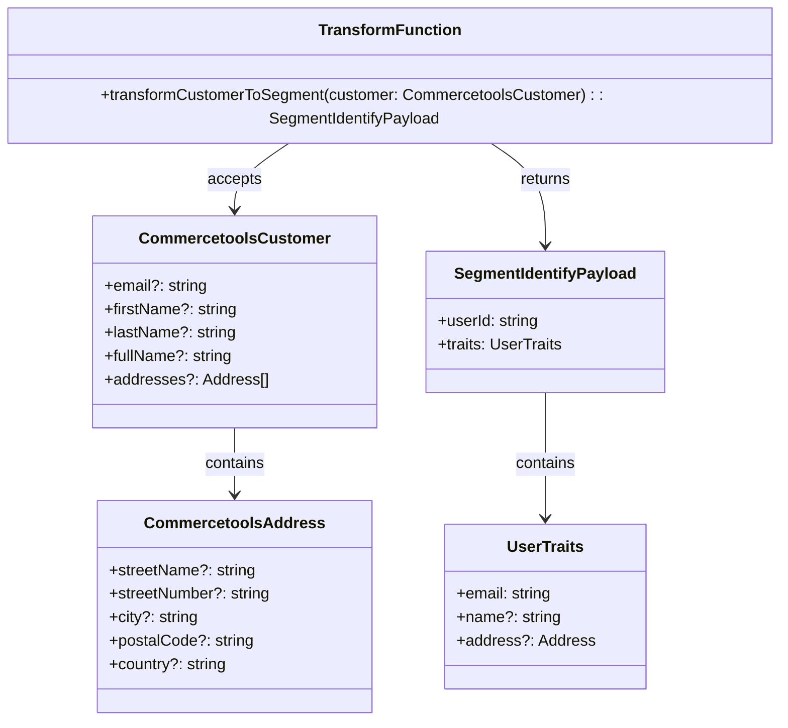
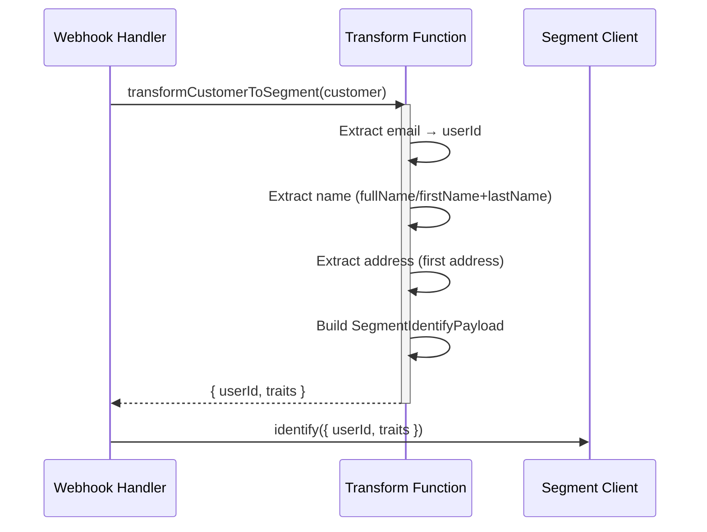

**Component:** Customer Data Transformation

**Contracts:**
- `transformCustomerToSegment(customer: CommercetoolsCustomer): SegmentIdentifyPayload`
- Input: Commercetools customer resource data
- Output: `{ userId: string, traits: UserTraits }`

**Types:**
```typescript
interface CommercetoolsCustomer {
  readonly email?: string | null;
  readonly firstName?: string | null;
  readonly lastName?: string | null;
  readonly fullName?: string | null;
  readonly addresses?: ReadonlyArray<CommercetoolsAddress> | null;
}

interface CommercetoolsAddress {
  readonly streetName?: string | null;
  readonly streetNumber?: string | null;
  readonly city?: string | null;
  readonly postalCode?: string | null;
  readonly country?: string | null;
}

interface SegmentIdentifyPayload {
  readonly userId: string;
  readonly traits: UserTraits;
}
```

**Dependencies:**
- Input: Commercetools customer resource (from webhook payload)
- Output: Segment `UserTraits` (from `src/segment/types.ts`)
- Pattern: Pure function (no side effects, no I/O)

**Field Mapping:**
- `email` → `userId` (required if email exists) + `traits.email`
- `firstName + lastName` → `traits.name` (prefer fullName if exists)
- `addresses[0]` → `traits.address` (streetName+streetNumber → street, city, postalCode, country)

**Behavior:**
- Missing/null fields: Omit from output (graceful handling)
- Email required: If no email, userId = undefined (transformation may fail or return partial)
- Name priority: fullName > firstName+lastName > firstName > lastName
- Address: Use first address if multiple exist

**Diagrams:**




**Story:** #3