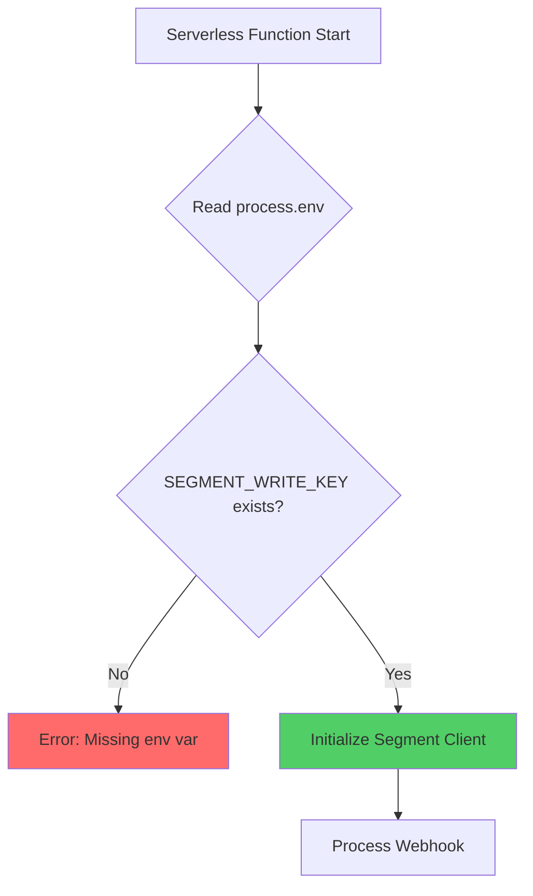

**Component:** Environment Variables Configuration

**Data Model:**
```typescript
interface EnvironmentConfig {
  readonly SEGMENT_WRITE_KEY: string;
}

type EnvVar = keyof EnvironmentConfig;
```

**Validation:**
- Required: `SEGMENT_WRITE_KEY` (non-empty string)
- Source: `process.env` in serverless function
- Type: String (Segment write key format)

**Documentation:**
- README: Document required env vars
- Vercel: Set via Vercel dashboard or CLI
- Local dev: `.env.local` (gitignored)

**Diagrams:**


**Story:** #1