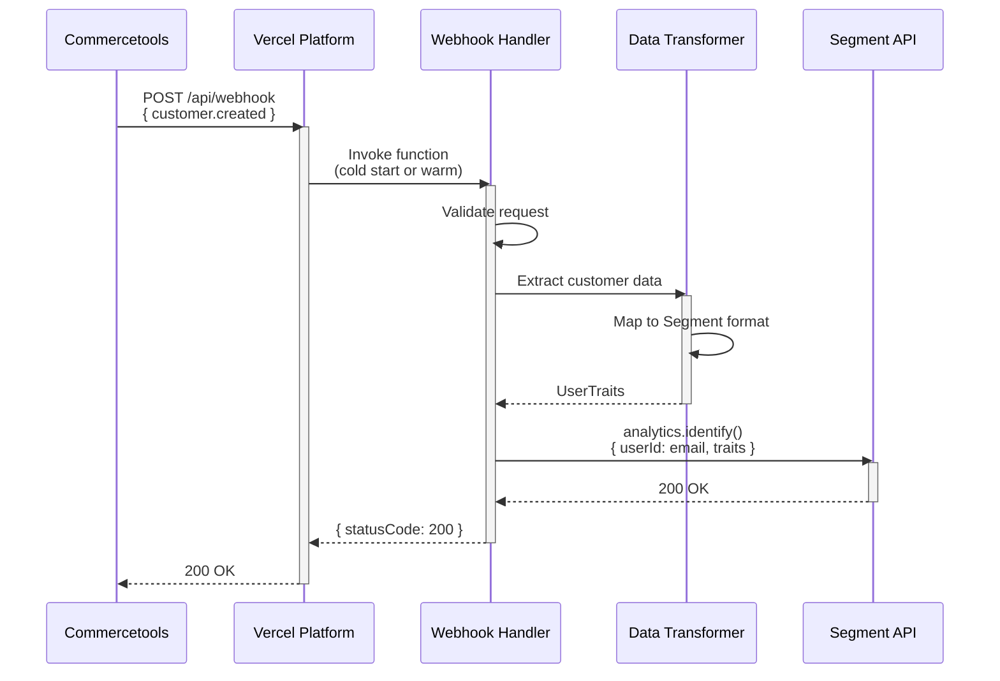

**Component:** End-to-End Integration Flow

**Data Flow:**
1. Commercetools → Webhook POST → Vercel `/api/webhook`
2. Vercel → Serverless Function → Parse payload
3. Serverless Function → Transform data → Segment format
4. Serverless Function → Segment API → Identify call
5. Segment API → Response → Serverless Function
6. Serverless Function → Response → Commercetools

**Integration Points:**
- **Commercetools → Vercel**: HTTP POST webhook delivery
- **Vercel → Segment**: HTTP POST via `@segment/analytics-node` SDK
- **Environment**: `SEGMENT_WRITE_KEY` from Vercel env vars

**Error Handling:**
- Invalid payload → 400 Bad Request
- Missing env var → 500 Internal Server Error
- Segment API error → 500 Internal Server Error (with error details)

**Diagrams:**

**Story:** #1