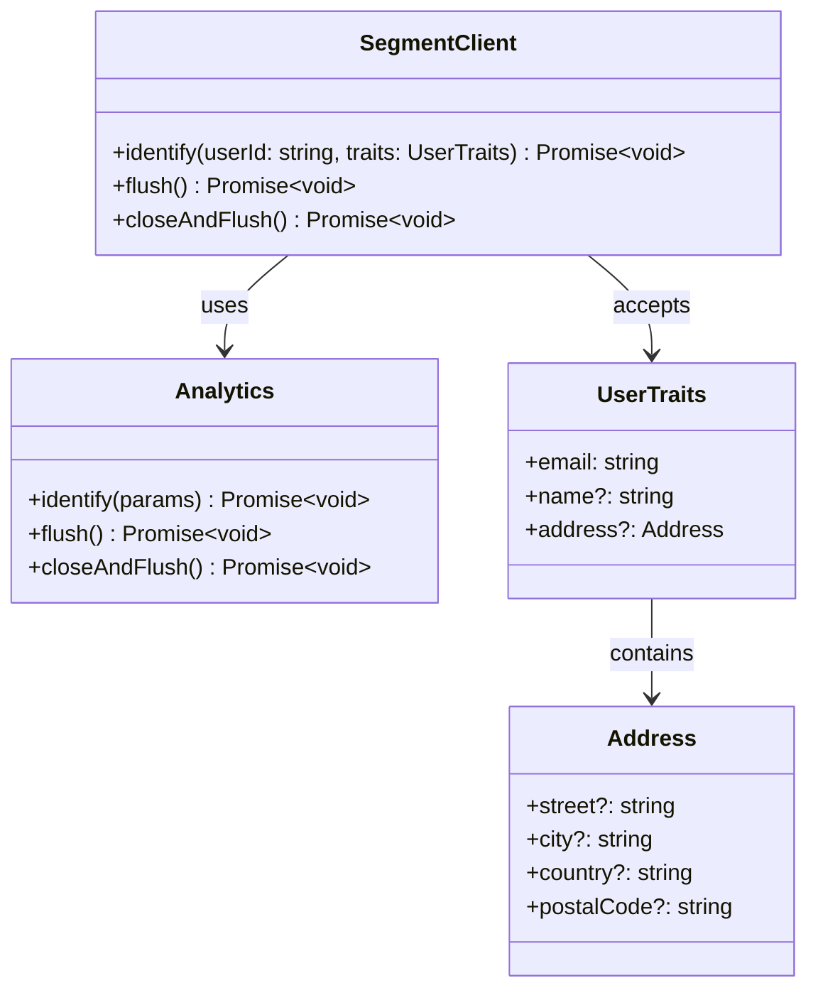

**Component:** Segment Analytics Client

**Contracts:**
- `identify(userId: string, traits: UserTraits): Promise<void>`
- `flush(): Promise<void>` (optional, for explicit flushing)

**Types:**
```typescript
interface UserTraits {
  readonly email: string;
  readonly name?: string;
  readonly address?: Address;
}

interface Address {
  readonly street?: string;
  readonly city?: string;
  readonly country?: string;
  readonly postalCode?: string;
}

interface SegmentClient {
  identify(params: { userId: string; traits: UserTraits }): Promise<void>;
  flush(): Promise<void>;
  closeAndFlush(): Promise<void>;
}
```

**Dependencies:**
- SegmentClient ← `@segment/analytics-node` Analytics instance
- Initialization: `new Analytics({ writeKey: string })`

**Diagrams:**


**Story:** #1