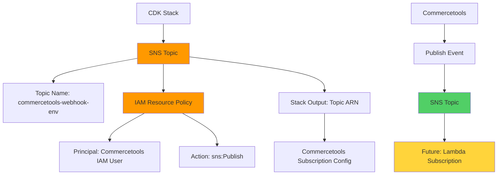
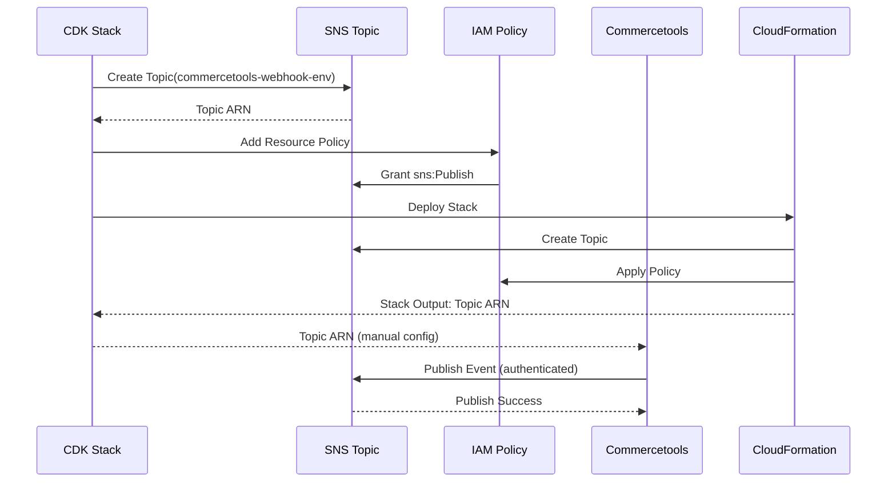
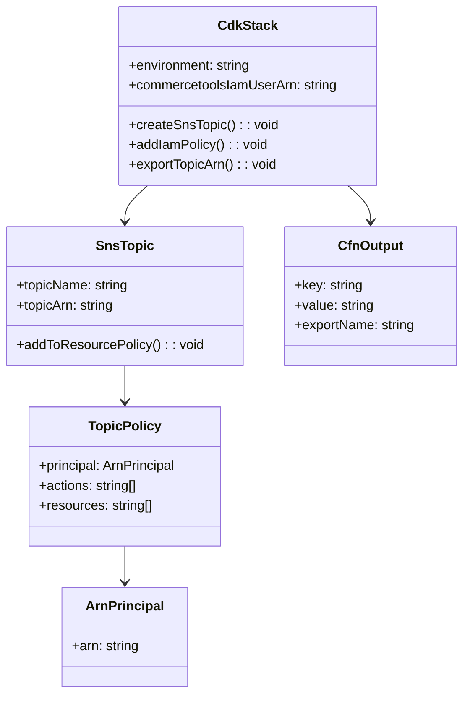
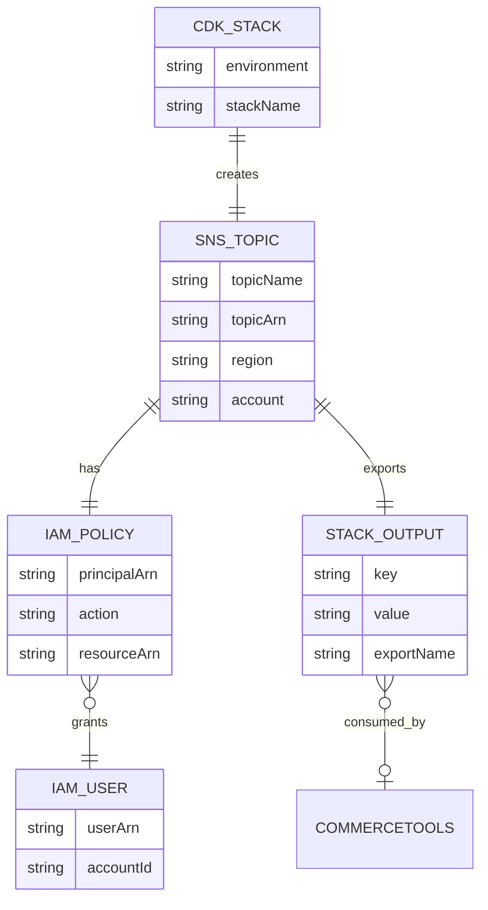
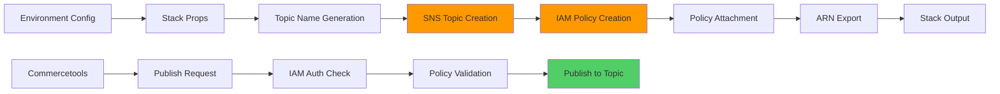

**Component:** SNS Topic Infrastructure

**Interfaces:**

```typescript
// Stack Props Extension
interface SnsStackProps extends CdkStackProps {
  readonly environment: 'dev' | 'staging' | 'prod';
  readonly commercetoolsIamUserArn: string;
}

// SNS Topic Configuration
interface SnsTopicConfig {
  readonly topicName: string; // commercetools-webhook-{env}
  readonly displayName?: string;
  readonly fifo?: boolean; // false for standard topic
}
```

**Contracts:**

**SNS Topic:**
- **Name:** `commercetools-webhook-{env}` (env from props)
- **Type:** Standard topic (not FIFO)
- **ARN Format:** `arn:aws:sns:{region}:{account}:commercetools-webhook-{env}`

**IAM Resource Policy:**
- **Principal:** `arn:aws:iam::362576667341:user/subscriptions`
- **Action:** `sns:Publish`
- **Resource:** Topic ARN
- **Effect:** Allow

**Stack Output:**
- **Key:** `SnsTopicArn`
- **Value:** Topic ARN (string)
- **Export:** Named export for cross-stack reference

**Types:**

```typescript
// SNS Topic Construct
class SnsTopicConstruct extends Construct {
  readonly topic: sns.Topic;
  readonly topicArn: string;
  
  constructor(scope: Construct, id: string, props: SnsTopicConfig);
}

// IAM Policy Statement
interface CommercetoolsPublishPolicy {
  readonly principal: iam.ArnPrincipal;
  readonly actions: ['sns:Publish'];
  readonly resources: [string]; // Topic ARN
}
```

**Dependencies:**
- `aws-cdk-lib/aws-sns.Topic`
- `aws-cdk-lib/aws-iam.PolicyStatement`, `ArnPrincipal`
- `aws-cdk-lib.Stack`, `CfnOutput`
- `constructs.Construct`

**Integration Points:**

**CDK Stack Integration:**
- Add SNS topic to `CdkStack` constructor
- Read environment from stack props or context
- Create topic with environment-aware name
- Add IAM resource policy to topic
- Export topic ARN as stack output

**Commercetools Integration:**
- Topic ARN used in Commercetools subscription configuration
- Commercetools publishes webhook events to topic
- IAM user `arn:aws:iam::362576667341:user/subscriptions` authenticates

**Environment Configuration:**
- Environment name from stack props: `dev` | `staging` | `prod`
- Default: `dev` if not specified
- Topic name includes environment: `commercetools-webhook-{env}`

**Diagrams:**









**Data Flow:**



**Environment Naming:**
- **dev:** `commercetools-webhook-dev`
- **staging:** `commercetools-webhook-staging`
- **prod:** `commercetools-webhook-prod`

**IAM User ARN:**
- **Fixed:** `arn:aws:iam::362576667341:user/subscriptions`
- **Account:** 362576667341 (Commercetools AWS account)
- **User:** subscriptions

**Stack Output Format:**
```json
{
  "SnsTopicArn": "arn:aws:sns:us-east-1:123456789012:commercetools-webhook-dev"
}
```