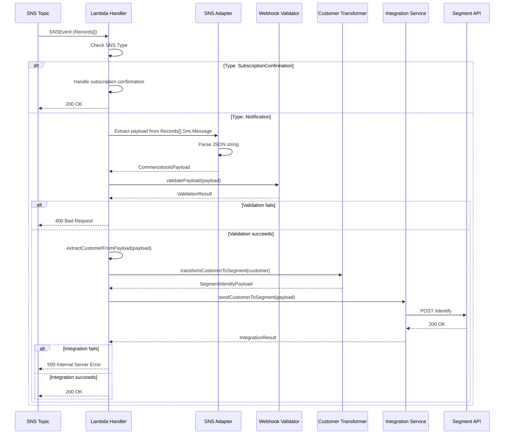
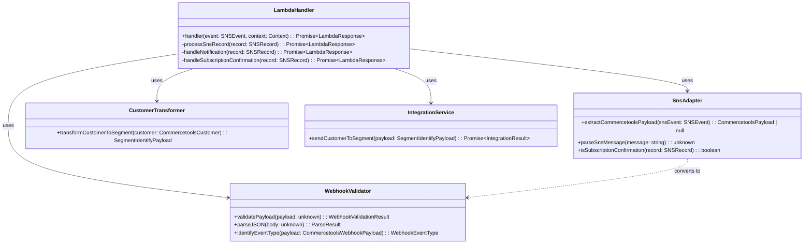
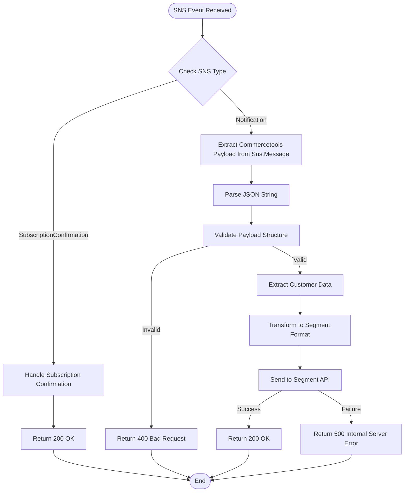

**Component:** Lambda Handler for SNS Events  
**Story:** #18

**Contracts:**
- Lambda handler: `(event: SNSEvent, context: Context) → Promise<LambdaResponse>`
- Adapter: `extractCommercetoolsPayload(snsEvent: SNSEvent) → CommercetoolsPayload | null`
- Format converter: `convertSnsMessageToRequestBody(snsMessage: string) → unknown`
- Subscription handler: `handleSubscriptionConfirmation(snsEvent: SNSEvent) → boolean`

**Types:**
```typescript
interface SNSEvent {
  Records: ReadonlyArray<{
    EventSource: 'aws:sns';
    EventVersion: string;
    EventSubscriptionArn: string;
    Sns: {
      Type: 'Notification' | 'SubscriptionConfirmation';
      MessageId: string;
      TopicArn: string;
      Subject?: string;
      Message: string; // JSON string containing Commercetools payload
      Timestamp: string;
      SignatureVersion: string;
      Signature: string;
      SigningCertUrl: string;
      UnsubscribeUrl: string;
      MessageAttributes?: Record<string, unknown>;
    };
  }>;
}

interface LambdaResponse {
  statusCode: number;
  body: string;
}

interface CommercetoolsPayload {
  notificationType: 'Message';
  type: string;
  resource: { typeId: string; id: string };
  projectKey: string;
  id: string;
  version: number;
  sequenceNumber: number;
  resourceVersion: number;
  createdAt: string;
  lastModifiedAt: string;
  customer?: unknown;
}
```

**Dependencies:**
- SNS Event → Lambda Handler → Adapter → Validator → Transformer → Integration Service → Segment
- Environment: `SEGMENT_WRITE_KEY` (required)
- AWS Lambda runtime: Node.js 24.3.0+

**Diagrams:**







**Integration Points:**

**1. SNS Event → Lambda Handler**
- Trigger: SNS topic subscription (from STORY-17)
- Event structure: AWS SNS event format with Records array
- Message location: `Records[].Sns.Message` (JSON string)

**2. Lambda Handler → Business Logic**
- Adapter extracts Commercetools payload from SNS Message
- Converts SNS event format to request body format
- Reuses existing validator, transformer, integration service
- No changes to business logic modules

**3. Error Handling**
- Validation errors: 400 Bad Request
- Transformation errors: 400 Bad Request
- Integration errors: 500 Internal Server Error
- Subscription confirmation: 200 OK (always succeeds)

**4. Multiple Records Processing**
- Lambda processes each Record in SNSEvent.Records array
- Each record processed independently
- Aggregate results across all records
- Return success if all records succeed, failure if any fails