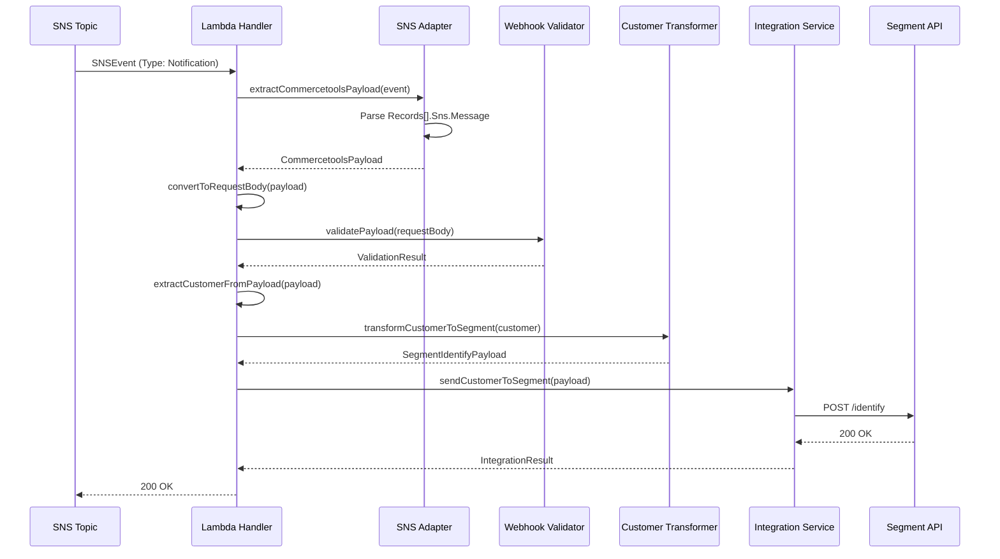
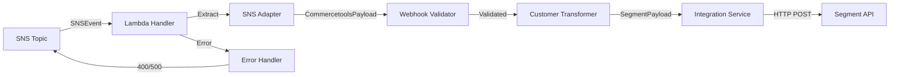

**Component:** Lambda Handler Integration Points  
**Story:** #18

**Integration Points:**

**1. SNS Topic → Lambda Handler**
- Trigger: SNS topic subscription (configured in CDK stack)
- Event format: AWS SNS event with Records array
- Message location: `Records[].Sns.Message` (JSON string)
- Message types: `Notification` (Commercetools payload), `SubscriptionConfirmation` (SNS lifecycle)

**2. Lambda Handler → SNS Adapter**
- Purpose: Extract and parse Commercetools payload from SNS event
- Input: `SNSEvent` with `Records[]`
- Process: Parse `Sns.Message` JSON string → CommercetoolsPayload
- Output: `CommercetoolsPayload | null`

**3. Lambda Handler → Webhook Validator**
- Purpose: Validate Commercetools payload structure
- Input: `RequestBody` (converted from CommercetoolsPayload)
- Process: Reuse existing `validatePayload()` function
- Output: `WebhookValidationResult` (isValid, eventType, error)

**4. Lambda Handler → Customer Transformer**
- Purpose: Transform customer data to Segment format
- Input: `CommercetoolsCustomer` (extracted from payload)
- Process: Reuse existing `transformCustomerToSegment()` function
- Output: `SegmentIdentifyPayload` (userId, traits)

**5. Lambda Handler → Integration Service**
- Purpose: Send customer data to Segment API
- Input: `SegmentIdentifyPayload`
- Process: Reuse existing `sendCustomerToSegment()` function
- Output: `SegmentIntegrationResult` (success, error)

**Diagrams:**





**Error Handling Integration:**

**1. Parse Errors (SNS Message)**
- Source: JSON.parse() in SNS adapter
- Handler: Catch parse exception
- Response: `400 Bad Request` with "Invalid JSON in SNS Message"

**2. Validation Errors**
- Source: Webhook validator
- Handler: Check `ValidationResult.isValid === false`
- Response: `400 Bad Request` with validator error message

**3. Transformation Errors**
- Source: Customer extraction or transformation
- Handler: Check for null customer or missing email
- Response: `400 Bad Request` with specific error message

**4. Integration Errors**
- Source: Segment API call
- Handler: Check `IntegrationResult.success === false`
- Response: `500 Internal Server Error` with Segment error details

**Multiple Records Processing:**

**Flow:**
1. Lambda receives SNSEvent with `Records[]` array
2. Process each record independently
3. Aggregate results across all records
4. Return success if all succeed, failure if any fails

**Implementation:**
- Map over `Records[]` array
- Process each record → `ProcessingResult`
- Collect all results
- Determine final status code (200 if all succeed, 400/500 if any fail)
- Return aggregated response

**Subscription Confirmation Integration:**

**Flow:**
1. Lambda receives SNSEvent with `Sns.Type === 'SubscriptionConfirmation'`
2. Identify subscription confirmation (no Commercetools payload)
3. Handle subscription confirmation (acknowledge)
4. Return `200 OK` (always succeeds)

**Implementation:**
- Check `Sns.Type` field
- If `SubscriptionConfirmation`: Skip business logic, return 200
- If `Notification`: Process Commercetools payload

**Data Flow:**

```
SNS Event
  └─► Records[]
      └─► SNSRecord
          └─► Sns.Message (JSON string)
              └─► Parse JSON
                  └─► CommercetoolsPayload
                      └─► Convert to RequestBody
                          └─► Validate
                              └─► Extract Customer
                                  └─► Transform
                                      └─► Send to Segment
```

**Component Dependencies:**

```
Lambda Handler
  ├─► SNS Adapter (new)
  ├─► Webhook Validator (existing)
  ├─► Customer Transformer (existing)
  └─► Integration Service (existing)
```

**Environment Dependencies:**
- `SEGMENT_WRITE_KEY`: Required for Segment API integration
- AWS Lambda runtime: Node.js 24.3.0+ (from package.json engines)
- AWS SNS: Topic subscription configured in CDK stack (STORY-17)