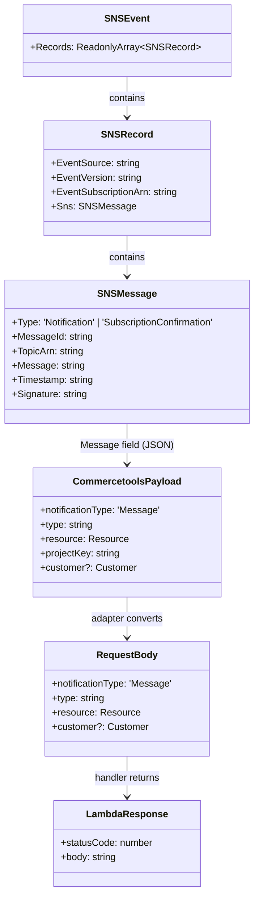
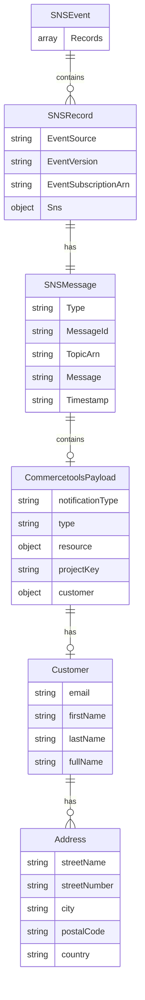

**Component:** Lambda Handler Interfaces & Data Models  
**Story:** #18

**Interfaces:**

**Lambda Handler Interface:**
```typescript
type LambdaHandler = (
  event: SNSEvent,
  context: Context
) => Promise<LambdaResponse>;
```

**SNS Adapter Interface:**
```typescript
interface SnsAdapter {
  extractCommercetoolsPayload(
    snsEvent: SNSEvent
  ): CommercetoolsPayload | null;
  
  parseSnsMessage(message: string): unknown;
  
  isSubscriptionConfirmation(record: SNSRecord): boolean;
  
  convertToRequestBody(
    commercetoolsPayload: CommercetoolsPayload
  ): RequestBody;
}
```

**Data Models:**

**SNS Event Structure:**
```typescript
interface SNSEvent {
  Records: ReadonlyArray<SNSRecord>;
}

interface SNSRecord {
  EventSource: 'aws:sns';
  EventVersion: string;
  EventSubscriptionArn: string;
  Sns: {
    Type: 'Notification' | 'SubscriptionConfirmation';
    MessageId: string;
    TopicArn: string;
    Subject?: string;
    Message: string; // JSON string
    Timestamp: string;
    SignatureVersion: string;
    Signature: string;
    SigningCertUrl: string;
    UnsubscribeUrl: string;
    MessageAttributes?: Record<string, unknown>;
  };
}
```

**Lambda Response:**
```typescript
interface LambdaResponse {
  statusCode: number;
  body: string;
  headers?: Record<string, string>;
}
```

**Request Body Format (for existing validator):**
```typescript
interface RequestBody {
  notificationType: 'Message';
  type: string;
  resource: { typeId: string; id: string };
  projectKey: string;
  id: string;
  version: number;
  sequenceNumber: number;
  resourceVersion: number;
  createdAt: string;
  lastModifiedAt: string;
  customer?: {
    email?: string | null;
    firstName?: string | null;
    lastName?: string | null;
    fullName?: string | null;
    addresses?: ReadonlyArray<Address> | null;
  };
}
```

**Error Types:**
```typescript
interface LambdaError {
  statusCode: number;
  body: {
    error: string;
    details?: string;
    eventType?: WebhookEventType;
  };
}
```

**Processing Result:**
```typescript
interface ProcessingResult {
  success: boolean;
  statusCode: number;
  body: string;
  recordIndex?: number;
  error?: string;
}
```

**Diagrams:**





**Contract Specifications:**

**1. SNS Event Extraction:**
- Input: `SNSEvent` with `Records[]`
- Extract: `Records[].Sns.Message` (JSON string)
- Parse: JSON.parse(Message) → CommercetoolsPayload
- Output: `CommercetoolsPayload | null`

**2. Format Conversion:**
- Input: `CommercetoolsPayload` (from SNS Message)
- Output: `RequestBody` (compatible with existing validator)
- Mapping: Direct field mapping (same structure)

**3. Subscription Confirmation:**
- Input: `SNSRecord` with `Sns.Type === 'SubscriptionConfirmation'`
- Action: Acknowledge subscription (no business logic)
- Output: `200 OK` response

**4. Error Handling:**
- Parse errors: `400 Bad Request` with "Invalid JSON in SNS Message"
- Validation errors: `400 Bad Request` with validator error message
- Integration errors: `500 Internal Server Error` with Segment error details