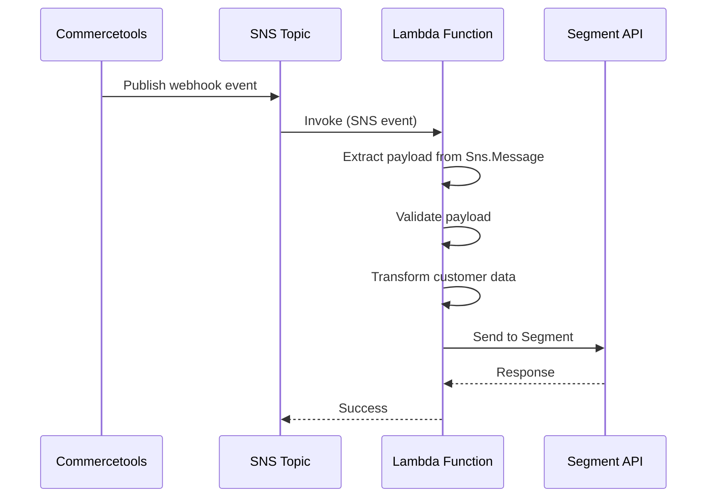
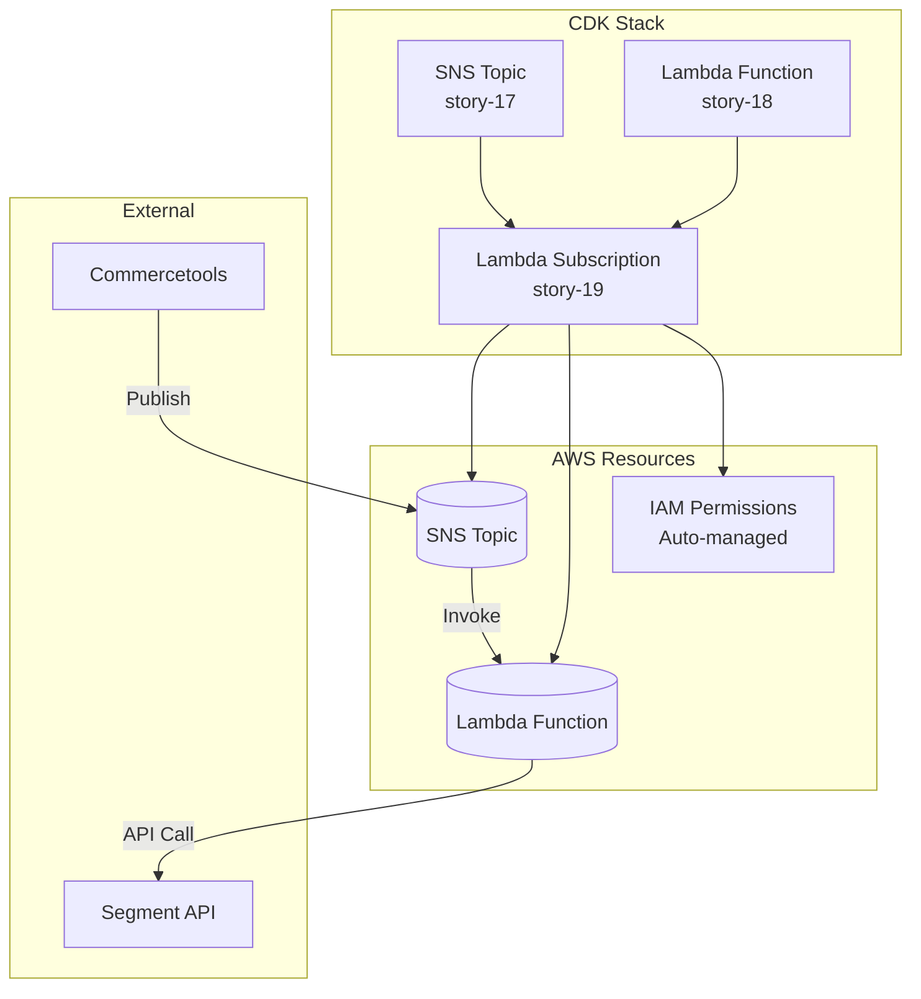
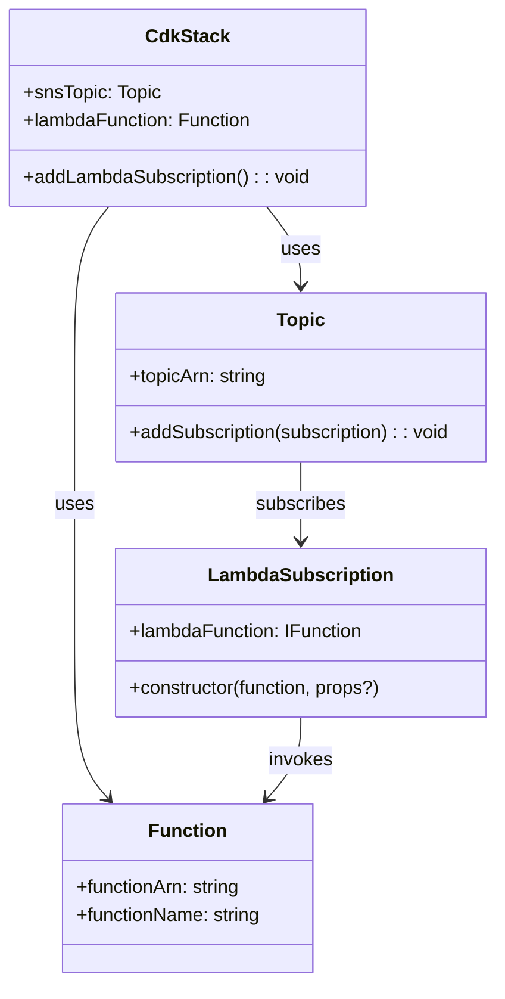
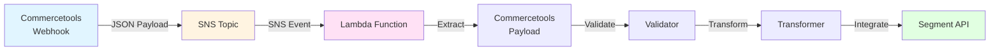
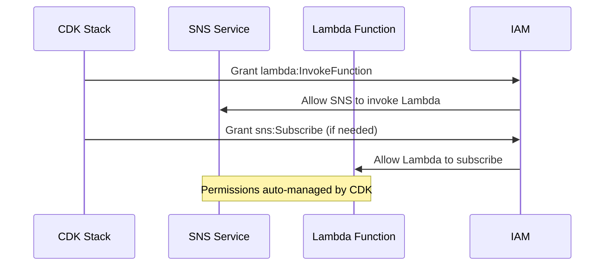

**Component:** Lambda-SNS Subscription Integration

**Interfaces:**

```typescript
// Stack Extension (assumes Lambda exists from story-18)
interface LambdaSnsStackProps extends CdkStackProps {
  readonly lambdaFunction: lambda.Function; // From story-18
}

// Subscription Configuration
interface LambdaSubscriptionConfig {
  readonly topic: sns.Topic; // From story-17
  readonly lambdaFunction: lambda.Function; // From story-18
  readonly deadLetterQueue?: sqs.Queue; // Optional, deferred
}
```

**Contracts:**

**SNS-Lambda Subscription:**
- **Method:** `topic.addSubscription(new LambdaSubscription(lambdaFunction))`
- **Type:** `aws-cdk-lib/aws-sns-subscriptions.LambdaSubscription`
- **Protocol:** Lambda (direct invocation)
- **Event Format:** SNS event with `Records[].Sns.Message` containing Commercetools payload

**IAM Permissions (Auto-managed by CDK):**
- **SNS → Lambda:** `lambda:InvokeFunction` on Lambda ARN (granted to SNS service principal)
- **Lambda → SNS:** `sns:Subscribe` (if needed, auto-granted by CDK)

**Event Flow:**
1. Commercetools publishes → SNS topic
2. SNS invokes → Lambda function (direct, no HTTP)
3. Lambda processes → SNS event format
4. Lambda extracts → Commercetools payload from `Sns.Message`
5. Lambda processes → Existing business logic (validator → transformer → integration)

**Types:**

```typescript
// SNS Event Structure (Lambda receives)
interface SnsEvent {
  Records: Array<{
    EventSource: 'aws:sns';
    EventVersion: string;
    EventSubscriptionArn: string;
    Sns: {
      Type: 'Notification' | 'SubscriptionConfirmation';
      MessageId: string;
      TopicArn: string;
      Subject?: string;
      Message: string; // JSON string containing Commercetools payload
      Timestamp: string;
      SignatureVersion: string;
      Signature: string;
      SigningCertUrl: string;
      UnsubscribeUrl: string;
    };
  }>;
}

// Lambda Subscription Construct
class LambdaSubscription extends SubscriptionBase {
  constructor(
    lambdaFunction: lambda.IFunction,
    props?: LambdaSubscriptionProps
  );
}
```

**Dependencies:**
- `aws-cdk-lib/aws-sns-subscriptions.LambdaSubscription`
- `aws-cdk-lib/aws-lambda.Function` (from story-18)
- `aws-cdk-lib/aws-sns.Topic` (from story-17)
- `aws-cdk-lib/aws-iam` (auto-managed permissions)

**Integration Points:**

**CDK Stack Integration:**
```typescript
// In CdkStack constructor
this.snsTopic.addSubscription(
  new subscriptions.LambdaSubscription(this.lambdaFunction)
);
```

**Event Processing Flow:**
```
Commercetools Webhook
  │
  ├─► SNS Topic (story-17)
  │   │
  │   └─► Lambda Subscription (story-19)
  │       │
  │       └─► Lambda Function (story-18)
  │           │
  │           ├─► Extract SNS Message
  │           ├─► Parse Commercetools Payload
  │           ├─► Validate (existing validator)
  │           ├─► Transform (existing transformer)
  │           └─► Integrate (existing Segment service)
```

**Mermaid Diagrams:**

**Sequence Diagram - Event Flow:**


**Component Diagram:**


**Class Diagram:**


**Data Flow Diagram:**


**IAM Permissions Flow:**
