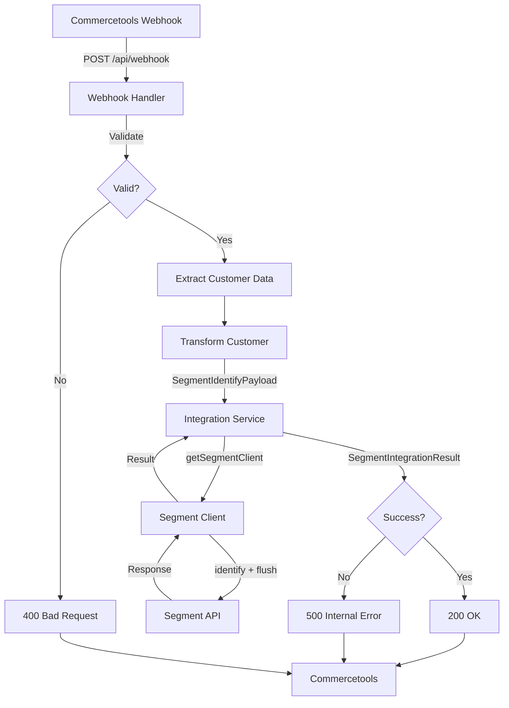
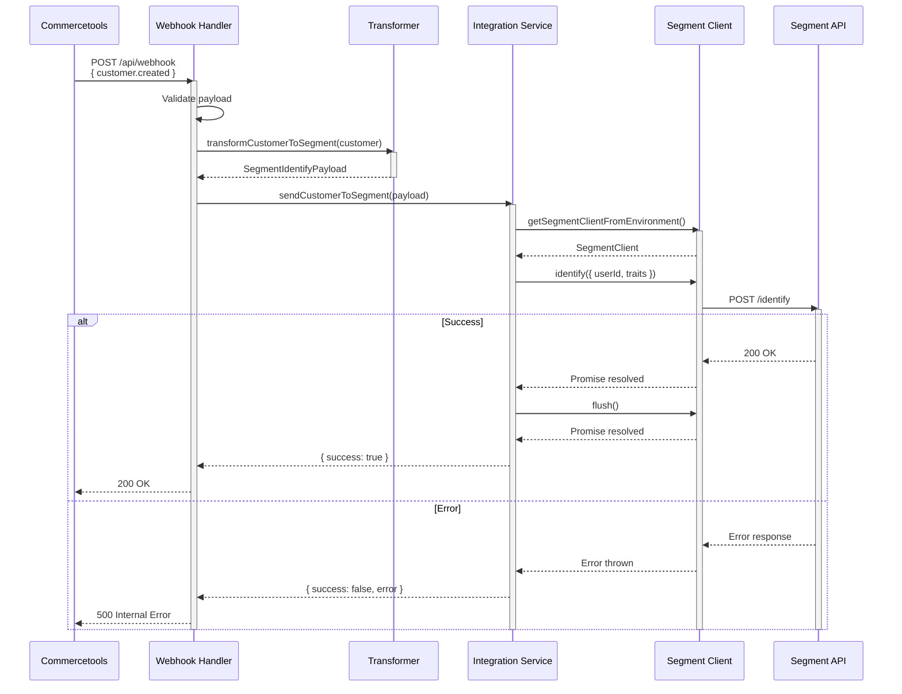

**Component:** End-to-End Segment Integration Flow

**Data Flow:**
1. Commercetools → Webhook POST → `/api/webhook`
2. Webhook Handler → Validate payload → Extract customer data
3. Transformation → Transform customer → SegmentIdentifyPayload
4. Integration Service → Send to Segment → SegmentIntegrationResult
5. Webhook Handler → Return HTTP response → Commercetools

**Integration Points:**
- **Transformation → Integration**: `SegmentIdentifyPayload` (userId + traits)
- **Integration → Segment Client**: `identify({ userId, traits })`
- **Segment Client → Segment API**: HTTP POST via SDK
- **Integration → Handler**: `SegmentIntegrationResult` (success/error)

**Error Flow:**
- Segment API error → Integration Service → Result<false, error>
- Handler checks result → Returns 500 or 200 based on result
- Error details logged but not exposed to caller

**Diagrams:**

**Story:** #4