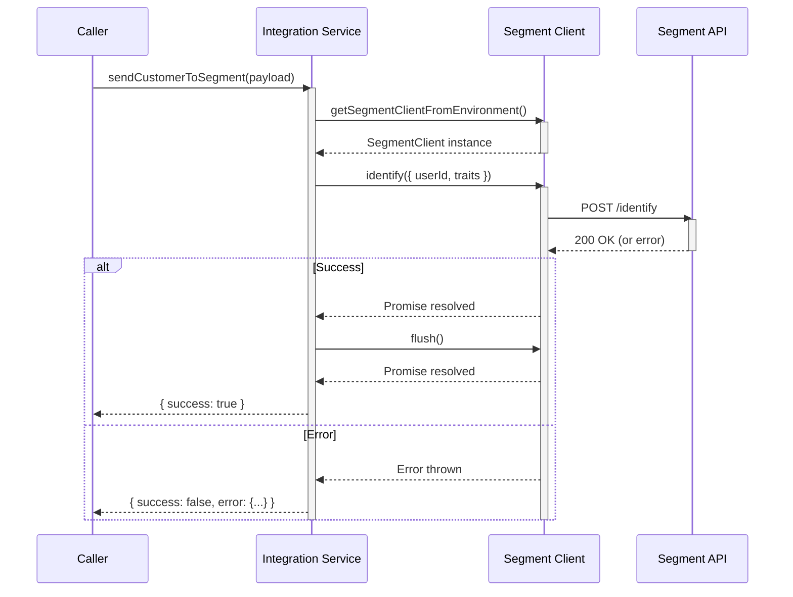
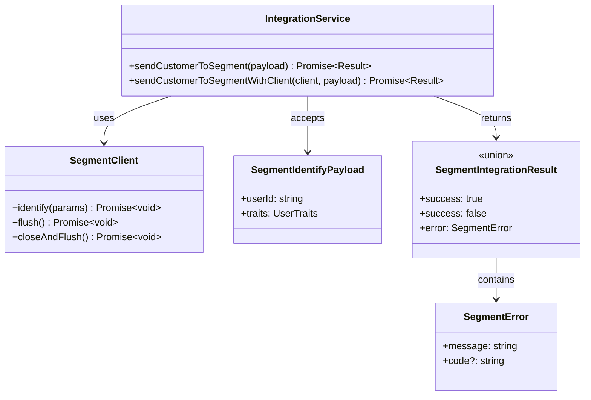

**Component:** Segment Integration Service

**Contracts:**
- `sendCustomerToSegment(payload: SegmentIdentifyPayload): Promise<SegmentIntegrationResult>`
- `sendCustomerToSegmentWithClient(client: SegmentClient, payload: SegmentIdentifyPayload): Promise<SegmentIntegrationResult>`

**Types:**
```typescript
type SegmentIntegrationResult = 
  | { success: true }
  | { success: false; error: SegmentError };

interface SegmentError {
  readonly message: string;
  readonly code?: string;
}
```

**Dependencies:**
- IntegrationService → SegmentClient (from environment or injected)
- IntegrationService → SegmentIdentifyPayload (from transformation)
- Uses: `getSegmentClientFromEnvironment()` for default client

**Data Flow:**
```
SegmentIdentifyPayload
    ↓
sendCustomerToSegment()
    ↓
getSegmentClientFromEnvironment()
    ↓
client.identify({ userId, traits })
    ↓
client.flush()
    ↓
SegmentIntegrationResult
```

**Error Handling:**
- Segment SDK errors → caught, wrapped in SegmentError
- Missing write key → error from client initialization
- Network errors → caught, returned as error result
- All errors return Result type (no exceptions)

**Diagrams:**




**Story:** #4