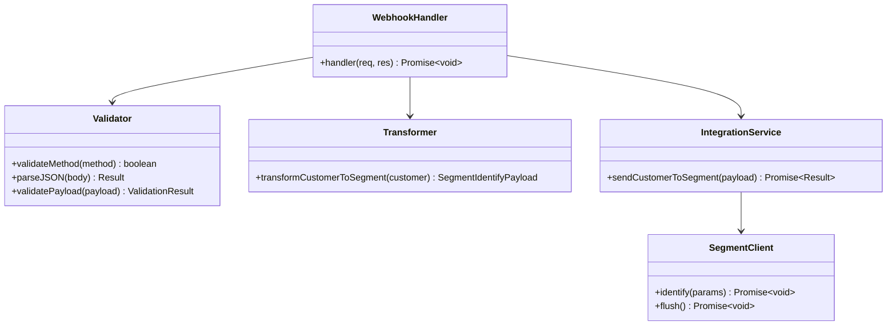
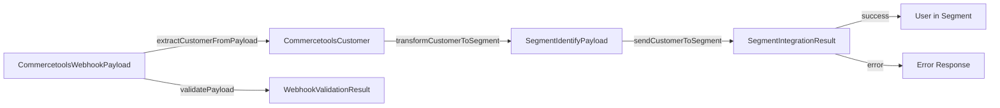

**Component:** Component Interfaces and Contracts

**Webhook Handler Interface:**
```typescript
type WebhookHandler = (
  req: VercelRequest,
  res: VercelResponse
) => Promise<void>;

// Request: POST /api/webhook
// Body: CommercetoolsWebhookPayload
// Response: 200 OK | 400 Bad Request | 500 Internal Server Error
```

**Data Transformer Interface:**
```typescript
function transformCustomerToSegment(
  customer: CommercetoolsCustomer
): SegmentIdentifyPayload;

// Input: CommercetoolsCustomer
// Output: SegmentIdentifyPayload { userId: string, traits: UserTraits }
```

**Integration Service Interface:**
```typescript
function sendCustomerToSegment(
  payload: Readonly<SegmentIdentifyPayload>
): Promise<SegmentIntegrationResult>;

// Input: SegmentIdentifyPayload
// Output: SegmentIntegrationResult { success: true } | { success: false, error }
```

**Segment Client Interface:**
```typescript
interface SegmentClient {
  identify(params: {
    readonly userId: string;
    readonly traits: UserTraits;
  }): Promise<void>;
  flush(): Promise<void>;
  closeAndFlush(): Promise<void>;
}
```

**API Contracts:**
- **Commercetools → Webhook**: POST `/api/webhook` with `CommercetoolsWebhookPayload`
- **Webhook → Commercetools**: 200 OK with `{ eventType, success: true }` or error
- **Integration → Segment API**: HTTP POST via `@segment/analytics-node` SDK
- **Segment API → Integration**: Promise resolution or rejection

**Data Models:**
```typescript
// Commercetools Customer Model
interface CommercetoolsCustomer {
  readonly email?: string | null;
  readonly firstName?: string | null;
  readonly lastName?: string | null;
  readonly fullName?: string | null;
  readonly addresses?: ReadonlyArray<CommercetoolsAddress> | null;
}

// Segment Identify Payload Model
interface SegmentIdentifyPayload {
  readonly userId: string; // email
  readonly traits: UserTraits;
}

// User Traits Model
interface UserTraits {
  readonly email: string;
  readonly name?: string;
  readonly address?: Address;
}

// Address Model
interface Address {
  readonly street?: string;
  readonly city?: string;
  readonly postalCode?: string;
  readonly country?: string;
}
```

**Dependencies:**
- Webhook Handler → Validator → Transformer → Integration Service → Segment Client
- All components use immutable data structures (ReadonlyArray, readonly)
- Error handling via Result types (success/error discriminated unions)

**Diagrams:**




**Story:** #5

