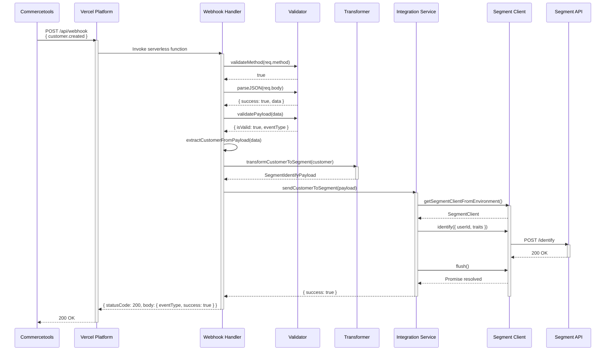
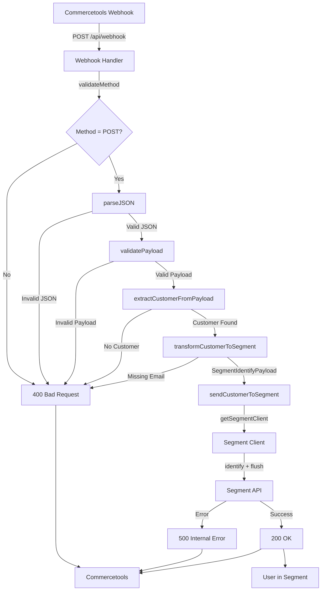

**Component:** End-to-End Integration Flow (Webhook → Transform → Segment)

**Contracts:**
- POST `/api/webhook` → `{ statusCode: 200, body: { eventType, success: true } }`
- Webhook Handler → Transform: `CommercetoolsCustomer` → `SegmentIdentifyPayload`
- Integration Service → Segment API: `identify({ userId, traits })` → `SegmentIntegrationResult`
- Segment API → User created/updated in Segment workspace

**Types:**
```typescript
interface CommercetoolsCustomer {
  readonly email?: string | null;
  readonly firstName?: string | null;
  readonly lastName?: string | null;
  readonly fullName?: string | null;
  readonly addresses?: ReadonlyArray<CommercetoolsAddress> | null;
}

interface SegmentIdentifyPayload {
  readonly userId: string; // email
  readonly traits: UserTraits;
}

interface UserTraits {
  readonly email: string;
  readonly name?: string;
  readonly address?: Address;
}

type SegmentIntegrationResult = 
  | { success: true }
  | { success: false; error: SegmentError };
```

**Dependencies:**
- Webhook Handler → Validator → Transformer → Integration Service → Segment Client
- Environment: `SEGMENT_WRITE_KEY` (required)
- Segment API: External dependency

**Data Flow:**
1. Commercetools → POST `/api/webhook` → Vercel serverless function
2. Webhook Handler → Validate method, parse JSON, validate payload
3. Webhook Handler → Extract customer data from payload
4. Transformer → Transform `CommercetoolsCustomer` → `SegmentIdentifyPayload`
5. Integration Service → Send to Segment API via `identify()` + `flush()`
6. Segment API → Create/update user identified by email
7. Webhook Handler → Return 200 OK to Commercetools

**Integration Points:**
- **Webhook → Handler**: HTTP POST with Commercetools payload
- **Handler → Transformer**: `transformCustomerToSegment(customer)`
- **Transformer → Integration**: `SegmentIdentifyPayload` (userId + traits)
- **Integration → Segment Client**: `identify({ userId, traits })`
- **Segment Client → Segment API**: HTTP POST via `@segment/analytics-node` SDK
- **Integration → Handler**: `SegmentIntegrationResult` (success/error)

**Error Handling:**
- Invalid method → 400 Bad Request
- Invalid JSON → 400 Bad Request
- Invalid payload → 400 Bad Request
- Missing customer data → 400 Bad Request
- Missing email → 400 Bad Request
- Segment API error → 500 Internal Server Error

**Diagrams:**




**Story:** #5

