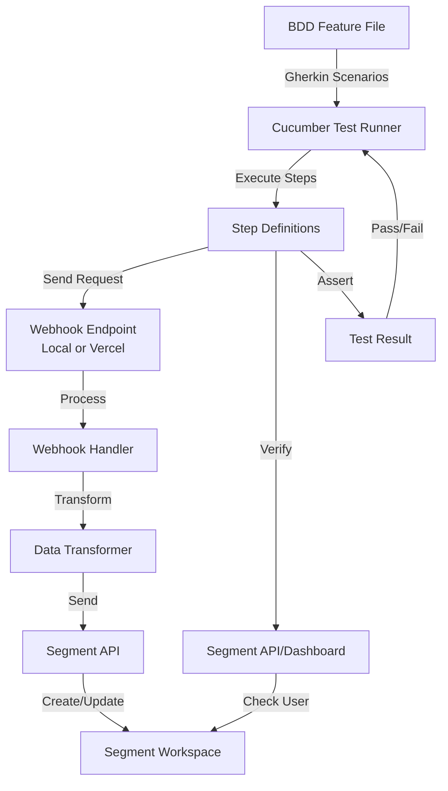
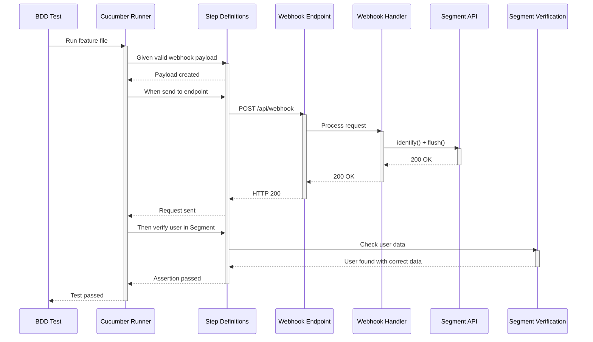

**Component:** Integration Testing (BDD with Cucumber)

**Contracts:**
- Feature files: `features/story-5-end-to-end-integration.feature`
- Step definitions: `tests/steps/story-5-end-to-end-integration.steps.ts`
- Test execution: `pnpm test:bdd` (Cucumber)
- Test environment: Local dev server or Vercel deployment

**Types:**
```typescript
// BDD Step Definitions
Given('a valid Commercetools customer.created webhook payload', ...)
When('I send the webhook payload to the webhook endpoint', ...)
Then('the customer should be created in Segment with userId "{string}"', ...)

// Test Data Structures
interface TestWebhookPayload {
  readonly notificationType: 'Message';
  readonly type: 'CustomerCreated' | 'CustomerUpdated';
  readonly customer: CommercetoolsCustomer;
  // ... other required fields
}

interface SegmentUserVerification {
  readonly userId: string;
  readonly traits: {
    readonly email: string;
    readonly name?: string;
    readonly address?: Address;
  };
}
```

**Dependencies:**
- Cucumber: BDD test framework
- Test webhook endpoint: Local or Vercel deployment
- Segment test workspace: For user verification
- Segment API: For verifying user data

**Test Scenarios:**
1. Complete flow for customer.created event creates user in Segment
2. Complete flow for customer.updated event updates user in Segment
3. User is identified by email in Segment
4. All three fields (email, name, address) are correctly synced
5. Complete flow processes customer.created event end-to-end
6. Complete flow processes customer.updated event end-to-end
7. Data flows correctly from webhook through transformation to Segment
8. Complete flow works with different customer data combinations (Scenario Outline)
9. Integration can be tested locally
10. Integration can be tested on Vercel

**Testing Strategy:**
- **Local Testing**: Run webhook handler locally, send test requests, verify Segment
- **Vercel Testing**: Deploy to Vercel, send test requests to production endpoint, verify Segment
- **Verification**: Check Segment dashboard or API for user data
- **Manual Testing**: Document procedures for manual validation

**Test Flow:**
1. Setup: Configure test environment (local or Vercel)
2. Given: Create test webhook payload with customer data
3. When: Send POST request to `/api/webhook` endpoint
4. Then: Verify HTTP 200 response
5. And: Verify user exists in Segment with correct data
6. Cleanup: Remove test data from Segment (if needed)

**Diagrams:**




**Story:** #5

