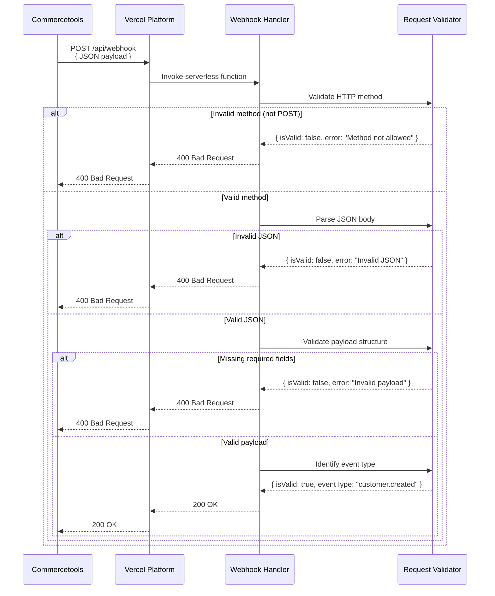
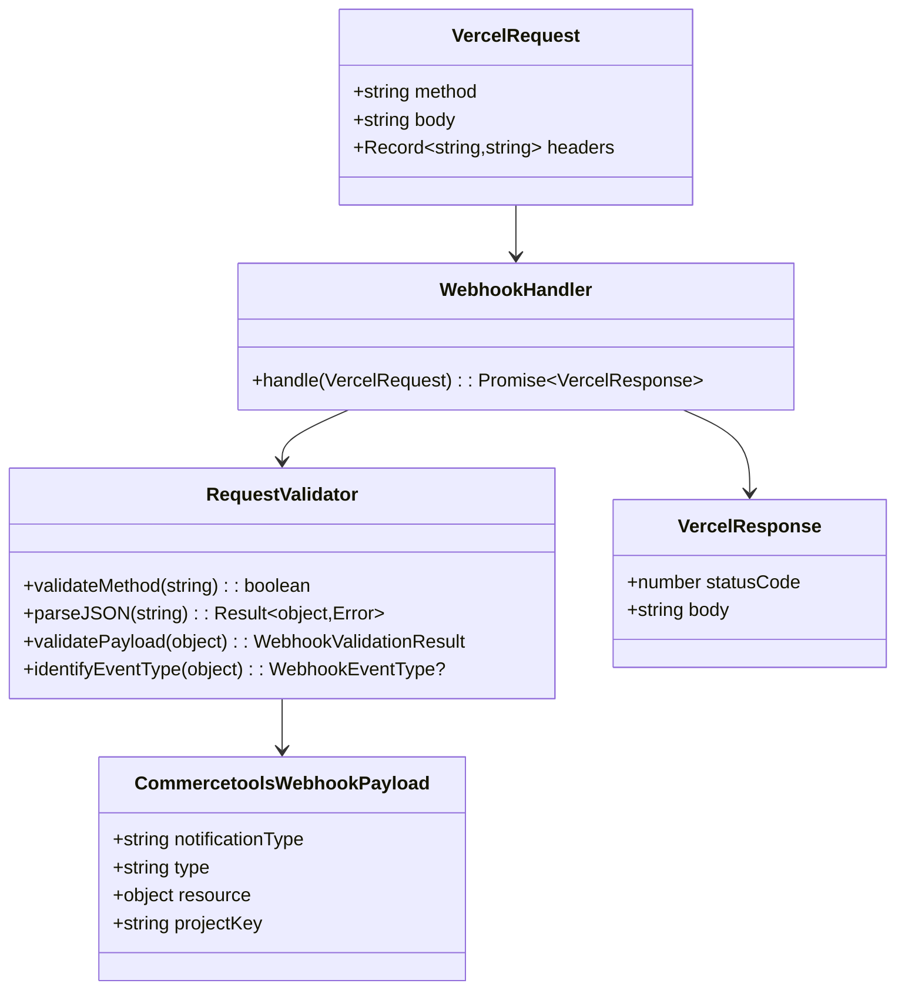

**Component:** Webhook Endpoint Handler

**Contracts:**
- HTTP POST `/api/webhook` → `{ statusCode: 200 | 400, body: string }`
- Request: VercelRequest with JSON body
- Response: 200 OK (valid) | 400 Bad Request (invalid method/JSON/payload)

**Types:**
```typescript
interface CommercetoolsWebhookPayload {
  readonly notificationType: 'Message';
  readonly type: string;
  readonly resource: {
    readonly typeId: string;
    readonly id: string;
  };
  readonly projectKey: string;
  readonly id: string;
  readonly version: number;
  readonly sequenceNumber: number;
  readonly resourceVersion: number;
  readonly createdAt: string;
  readonly lastModifiedAt: string;
}

type WebhookEventType = 'customer.created' | 'customer.updated';

interface WebhookValidationResult {
  readonly isValid: boolean;
  readonly eventType?: WebhookEventType;
  readonly error?: string;
}
```

**Dependencies:**
- VercelRequest → WebhookHandler → Validation → Response
- No external dependencies (no Segment calls, no env vars)

**Event Type Mapping:**
- `type: "CustomerCreated"` → `eventType: "customer.created"`
- `type: "CustomerUpdated"` → `eventType: "customer.updated"`

**Diagrams:**




**Story:** #2

