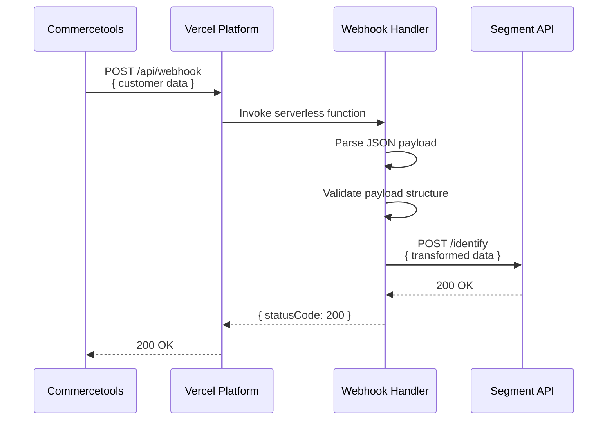

**Component:** Webhook Handler (Serverless Function)

**Contracts:**
- HTTP POST `/api/webhook` → `{ statusCode: number, body: string }`
- Request: `{ headers: Record<string, string>, body: string }`
- Response: `200 OK` (success) | `400 Bad Request` (invalid payload) | `500 Internal Server Error`

**Types:**
```typescript
interface WebhookRequest {
  readonly headers: Readonly<Record<string, string>>;
  readonly body: string;
}

interface WebhookResponse {
  readonly statusCode: number;
  readonly body: string;
}

type WebhookHandler = (req: WebhookRequest) => Promise<WebhookResponse>;
```

**Dependencies:**
- VercelRequest → WebhookHandler → SegmentClient
- Environment: `SEGMENT_WRITE_KEY` (required)

**Diagrams:**


**Story:** #1