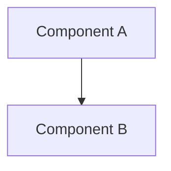
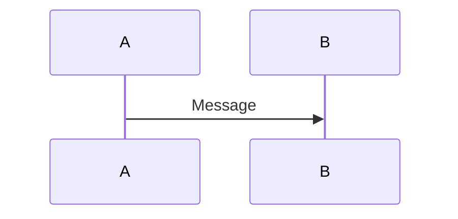
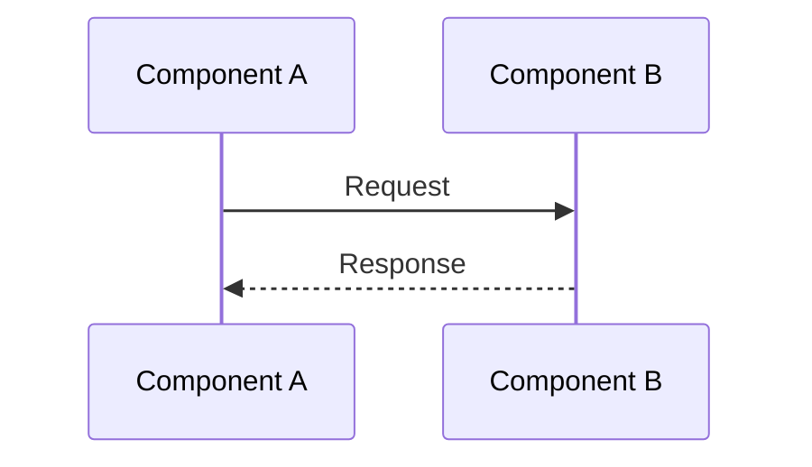

# STORY-18 Documentation Patterns and Standards

**Component:** Documentation Standards  
**Story:** #18  
**Last Updated:** 2025-12-02

## Documentation Structure

### Memory Categories

Documentation is organized into memory categories:

- **DOC:** Component documentation (API, usage, architecture, troubleshooting)
- **ARC:** Architecture design documents
- **ADR:** Architecture decision records
- **IMP:** Implementation plans
- **CRV:** Code review findings

### Documentation Tags

Standard tags for DOC memories:

- **Story ID:** `story-{number}` (e.g., `story-18`)
- **Status:** `status/active` or `status/implemented`
- **Topic:** `topic/api`, `topic/examples`, `topic/architecture`, `topic/troubleshooting`, `topic/patterns`
- **Component:** `component/{name}` (e.g., `component/lambda`, `component/sns`, `component/adapter`)

## Documentation Templates

### API Documentation Template

```markdown
# {Component} API Documentation

**Component:** {Component Name}  
**Story:** #{Story Number}  
**Last Updated:** {Date}

## Overview

Brief description of the component and its purpose.

## Public Interfaces

### {Interface Name}

```typescript
// Interface definition
```

#### Properties

- **`property: type`**  
  Description of property.

## Methods

### `methodName(params): returnType`

Description of method.

**Parameters:**
- **`param: type`** - Description

**Returns:**
- Description of return value

**Throws:**
- Error conditions

## Examples

```typescript
// Usage example
```

## Related Documentation
```

### Usage Examples Template

```markdown
# {Component} Usage Examples

**Component:** {Component Name}  
**Story:** #{Story Number}  
**Last Updated:** {Date}

## Basic Usage

### {Use Case Name}

```typescript
// Code example
```

## Common Use Cases

### 1. {Use Case}

```typescript
// Example code
```

## Error Handling Examples

### {Error Scenario}

```typescript
// Error handling example
```

## Testing Patterns

### {Test Type}

```typescript
// Test example
```
```

### Architectural Documentation Template

```markdown
# {Component} Architectural Documentation

**Component:** {Component Name}  
**Story:** #{Story Number}  
**Last Updated:** {Date}

## Architecture Overview

Description of architecture and design principles.

## Component Architecture

### Component Diagram



## Data Flow

### Processing Flow



## Design Decisions

### Decision 1: {Decision Name}

**Rationale:**
- Reason for decision

**Implementation:**
- How it's implemented
```

### Troubleshooting Guide Template

```markdown
# {Component} Troubleshooting Guide

**Component:** {Component Name}  
**Story:** #{Story Number}  
**Last Updated:** {Date}

## Common Issues and Solutions

### Issue 1: {Issue Name}

**Symptoms:**
- Symptom description

**Possible Causes:**
1. Cause 1
2. Cause 2

**Solutions:**

1. **Solution 1:**
   ```typescript
   // Code example
   ```

**Debugging Steps:**
1. Step 1
2. Step 2

## Error Messages Reference

### {Error Code} Errors

**"{Error Message}"**
- **Cause:** Cause description
- **Solution:** Solution description
```

## Documentation Best Practices

### 1. API Documentation

**Do:**
- Document all public interfaces
- Include parameter descriptions
- Document return types
- Include usage examples
- Document error conditions

**Don't:**
- Document internal functions
- Skip type information
- Use vague descriptions
- Omit examples

### 2. Usage Examples

**Do:**
- Provide complete, runnable examples
- Include error handling examples
- Show common use cases
- Include testing patterns
- Use realistic data

**Don't:**
- Use placeholder data without context
- Skip error handling
- Show incomplete examples
- Use unrealistic scenarios

### 3. Architecture Documentation

**Do:**
- Use Mermaid diagrams for complex flows
- Include component relationships
- Document design decisions
- Explain rationale
- Show data flow

**Don't:**
- Use unclear diagrams
- Skip component labels
- Omit design rationale
- Mix diagram types inconsistently

### 4. Troubleshooting Guides

**Do:**
- Provide specific error messages
- Include step-by-step solutions
- Show debugging techniques
- Include code examples
- Reference related documentation

**Don't:**
- Use generic error descriptions
- Skip error context
- Provide vague solutions
- Omit debugging steps

## Documentation Organization

### File Naming

DOC memories follow this pattern:
```
(DOC)({component-name}-{topic})({uuid}).md
```

Examples:
- `(DOC)(story-18-lambda-handler-api-documentation)(uuid).md`
- `(DOC)(story-18-lambda-handler-usage-examples)(uuid).md`
- `(DOC)(story-18-lambda-handler-architectural-documentation)(uuid).md`
- `(DOC)(story-18-lambda-handler-troubleshooting-guide)(uuid).md`

### Memory Structure

Each DOC memory should include:

1. **Frontmatter:**
   - `id`: UUID
   - `title`: Descriptive title
   - `tags`: Story ID, status, topic, components
   - `category`: `DOC`
   - `created_at`, `updated_at`, `last_reviewed`: ISO timestamps
   - `abstract`: One-sentence summary

2. **Content:**
   - Title with component and story number
   - Overview section
   - Main content sections (varies by topic)
   - Related documentation links

### Content Sections

Standard sections for different documentation types:

**API Documentation:**
- Overview
- Public Interfaces
- Methods
- Type Definitions
- Error Handling
- Dependencies
- Related Documentation

**Usage Examples:**
- Basic Usage
- Common Use Cases
- Error Handling Examples
- Testing Patterns
- Integration Examples

**Architectural Documentation:**
- Architecture Overview
- Component Architecture
- Data Flow
- Design Decisions
- Integration Points
- Scalability Considerations
- Security Architecture

**Troubleshooting:**
- Common Issues and Solutions
- Error Messages Reference
- Debugging Tips
- Common Patterns
- Getting Help

## Code Examples in Documentation

### TypeScript Examples

```typescript
// Always include complete, runnable examples
import handler from './src/lambda/handler.js';
import type { SNSEvent } from './src/lambda/types.js';

const event: SNSEvent = {
  // Complete event structure
};

const response = await handler(event, context);
```

### Mermaid Diagrams



## Documentation Maintenance

### Update Frequency

- **API Documentation:** Update when interfaces change
- **Usage Examples:** Update when usage patterns change
- **Architecture Documentation:** Update when architecture changes
- **Troubleshooting:** Update when new issues are discovered

### Review Process

1. **Code Changes:** Update documentation when code changes
2. **New Issues:** Add to troubleshooting guide when new issues found
3. **Regular Reviews:** Review documentation quarterly
4. **User Feedback:** Incorporate user feedback and questions

## Quality Checklist

### API Documentation Checklist

- [ ] All public interfaces documented
- [ ] Parameter types and descriptions included
- [ ] Return types documented
- [ ] Error conditions documented
- [ ] Usage examples provided
- [ ] Related documentation linked

### Usage Examples Checklist

- [ ] Complete, runnable examples
- [ ] Common use cases covered
- [ ] Error handling examples included
- [ ] Testing patterns shown
- [ ] Realistic data used

### Architecture Documentation Checklist

- [ ] Component relationships shown
- [ ] Data flow documented
- [ ] Design decisions explained
- [ ] Diagrams included and clear
- [ ] Integration points documented

### Troubleshooting Checklist

- [ ] Common issues documented
- [ ] Solutions provided
- [ ] Debugging steps included
- [ ] Error messages referenced
- [ ] Related documentation linked

## Documentation Standards for Lambda Components

### Lambda-Specific Documentation

**Required Sections:**
- Lambda function signature
- Event structure (SNS, API Gateway, etc.)
- Environment variables
- Error handling
- Deployment configuration

**Example Structure:**
```markdown
## Lambda Handler

### `handler(event: SNSEvent, context: Context): Promise<LambdaResponse>`

Main Lambda handler function.

**Event Structure:**
- SNS event format
- Record structure
- Message format

**Environment Variables:**
- Required variables
- Optional variables

**Error Handling:**
- Status codes
- Error response format
```

### SNS-Specific Documentation

**Required Sections:**
- SNS event structure
- Message extraction
- Subscription confirmation handling
- Multiple records processing

**Example Structure:**
```markdown
## SNS Event Processing

### Event Structure

```typescript
interface SNSEvent {
  Records: ReadonlyArray<SNSRecord>;
}
```

### Message Extraction

Extract Commercetools payload from SNS Message field.

### Subscription Confirmation

Handle SNS subscription confirmation events.
```

## Related Documentation

- [STORY-1 Documentation Patterns](../DOC/story-1-documentation-patterns-and-standards.md)
- [STORY-17 Documentation Patterns](../DOC/story-17-documentation-patterns-and-standards.md)
- [STORY-18 API Documentation](./story-18-lambda-handler-api-documentation.md)
- [STORY-18 Usage Examples](./story-18-lambda-handler-usage-examples.md)
- [STORY-18 Architecture Documentation](./story-18-lambda-handler-architectural-documentation.md)
- [STORY-18 Troubleshooting Guide](./story-18-lambda-handler-troubleshooting-guide.md)

