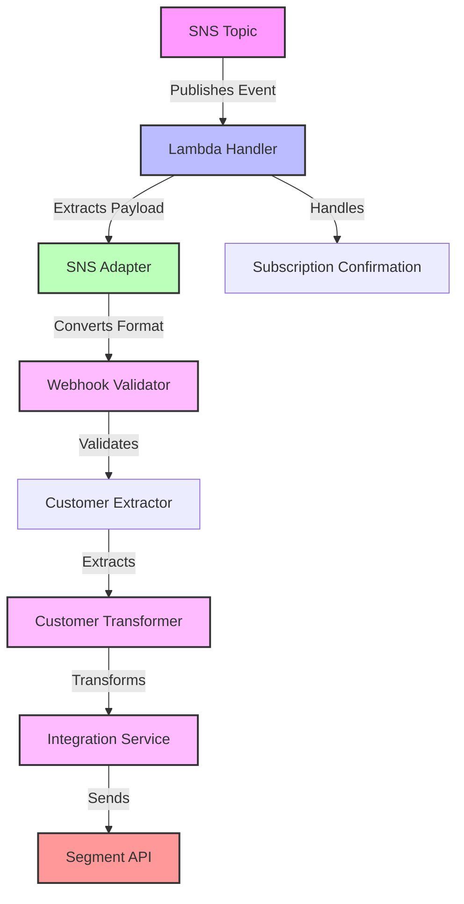
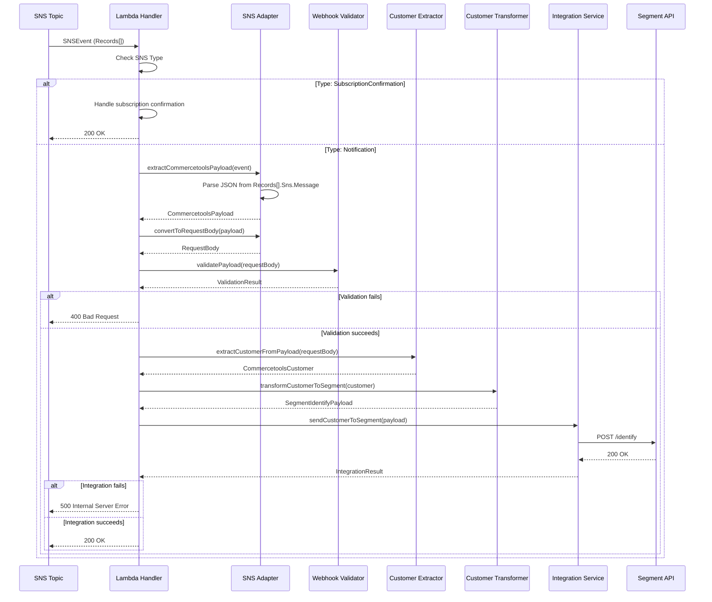

# STORY-18 Lambda Handler Architectural Documentation

**Component:** AWS Lambda Handler for SNS Events  
**Story:** #18  
**Last Updated:** 2025-12-02

## Architecture Overview

The Lambda handler architecture provides a serverless solution for processing Commercetools webhook events via AWS SNS. The implementation follows an adapter pattern to bridge SNS event format with existing business logic, ensuring code reuse and maintainability.

### Key Design Principles

1. **Separation of Concerns:** Adapter layer separates SNS event handling from business logic
2. **Code Reuse:** Reuses existing validator, transformer, and integration service
3. **Type Safety:** Strong TypeScript typing throughout the stack
4. **Error Handling:** Comprehensive error handling with appropriate status codes
5. **Scalability:** Stateless design supports horizontal scaling

## Component Architecture

### Component Diagram

### Component Responsibilities

#### Lambda Handler (`src/lambda/handler.ts`)

**Responsibilities:**
- Entry point for AWS Lambda invocations
- Processes SNS event records
- Orchestrates business logic flow
- Aggregates processing results
- Returns appropriate HTTP status codes

**Key Functions:**
- `handler()` - Main Lambda entry point
- `processSnsRecord()` - Processes single SNS record
- `handleNotification()` - Handles Commercetools notifications
- `handleSubscriptionConfirmation()` - Handles SNS subscription confirmations
- `validateAndExtractCustomer()` - Validates and extracts customer data
- `sendToSegment()` - Sends customer data to Segment

#### SNS Adapter (`src/lambda/adapter.ts`)

**Responsibilities:**
- Extracts Commercetools payloads from SNS events
- Converts SNS event format to request body format
- Identifies subscription confirmation events
- Parses JSON from SNS Message fields

**Key Functions:**
- `extractCommercetoolsPayload()` - Extracts payload from SNS event
- `parseSnsMessage()` - Parses JSON string from Message field
- `isSubscriptionConfirmation()` - Checks if record is subscription confirmation
- `convertToRequestBody()` - Converts payload to request body format

#### Customer Extractor (`src/lambda/customer-extractor.ts`)

**Responsibilities:**
- Extracts customer data from webhook payloads
- Handles address extraction (single or array)
- Validates customer data structure
- Returns typed customer objects

**Key Functions:**
- `extractCustomerFromPayload()` - Extracts customer from payload
- `extractAddresses()` - Extracts address array
- `extractAddress()` - Extracts single address
- `extractStringOrNull()` - Helper for string extraction

## Data Flow

### Processing Flow

### Data Transformation Flow

```mermaid
graph LR
    A[SNS Event] -->|extractCommercetoolsPayload| B[Commercetools Payload]
    B -->|convertToRequestBody| C[RequestBody]
    C -->|validatePayload| D[Validated Payload]
    D -->|extractCustomerFromPayload| E[Commercetools Customer]
    E -->|transformCustomerToSegment| F[Segment Identify Payload]
    F -->|sendCustomerToSegment| G[Segment API]
    
    style A fill:#f9f,stroke:#333,stroke-width:2px
    style B fill:#bbf,stroke:#333,stroke-width:2px
    style C fill:#bfb,stroke:#333,stroke-width:2px
    style D fill:#fbf,stroke:#333,stroke-width:2px
    style E fill:#fbf,stroke:#333,stroke-width:2px
    style F fill:#fbf,stroke:#333,stroke-width:2px
    style G fill:#f99,stroke:#333,stroke-width:2px
```

## Integration Points

### 1. SNS Topic → Lambda Handler

**Trigger:** SNS topic subscription (from STORY-17)  
**Event Format:** AWS SNS event with Records array  
**Message Location:** `Records[].Sns.Message` (JSON string)

**Integration Details:**
- Lambda function subscribed to SNS topic
- SNS invokes Lambda asynchronously
- Each SNS message creates one Lambda invocation
- Multiple records in single invocation supported

### 2. Lambda Handler → Business Logic

**Adapter Pattern:** SNS adapter converts event format to request body format  
**Reused Components:**
- `validatePayload()` - Webhook validator
- `transformCustomerToSegment()` - Customer transformer
- `sendCustomerToSegment()` - Integration service

**Compatibility:**
- No changes to existing business logic
- Adapter ensures format compatibility
- Same validation and transformation logic

### 3. Lambda Handler → Segment API

**Integration:** Via existing integration service  
**Authentication:** Segment write key from environment variable  
**Payload Format:** Segment Identify API format

## Design Decisions

### Decision 1: Adapter Pattern for Format Conversion

**Rationale:**
- Reuses existing business logic without modification
- Separates SNS event handling from business logic
- Maintains single responsibility principle

**Implementation:**
- `convertToRequestBody()` converts SNS payload to request body format
- Existing validator accepts request body format
- No changes to validator, transformer, or integration service

### Decision 2: Parallel Record Processing

**Rationale:**
- SNS events can contain multiple records
- Parallel processing improves performance
- Independent record processing enables partial success handling

**Implementation:**
- `Promise.all()` processes all records in parallel
- Each record processed independently
- Aggregate results determine final status code

### Decision 3: Subscription Confirmation Handling

**Rationale:**
- SNS requires subscription confirmation during topic setup
- Confirmation should not trigger business logic
- Simple acknowledgment is sufficient

**Implementation:**
- `isSubscriptionConfirmation()` checks SNS Type field
- `handleSubscriptionConfirmation()` returns 200 OK
- No business logic executed for confirmations

### Decision 4: Error Status Code Mapping

**Rationale:**
- Clear error categorization for debugging
- Appropriate HTTP status codes for different error types
- Consistent error handling across the system

**Implementation:**
- **400 Bad Request:** Validation errors, missing data, invalid format
- **500 Internal Server Error:** External API failures, unexpected errors
- **200 OK:** Successful processing

### Decision 5: Type Safety with TypeScript

**Rationale:**
- Strong typing prevents runtime errors
- Better IDE support and autocomplete
- Self-documenting code

**Implementation:**
- Explicit types for all function parameters and returns
- Type guards for runtime validation
- Discriminated unions for state management

## Scalability Considerations

### Horizontal Scaling

**Lambda Auto-Scaling:**
- AWS Lambda automatically scales based on SNS message volume
- Each SNS message triggers independent Lambda invocation
- No shared state between invocations

**Concurrency Limits:**
- Default Lambda concurrency: 1000 concurrent executions
- Can be increased via AWS support
- SNS topic can handle high message throughput

### Performance Optimization

**Cold Start Mitigation:**
- Node.js 20.x runtime for faster cold starts
- Minimal dependencies to reduce bundle size
- Connection pooling for Segment API (via integration service)

**Memory Configuration:**
- Recommended: 256 MB memory
- Adjustable based on payload size and processing time
- More memory = more CPU allocation

### Cost Optimization

**Lambda Pricing:**
- Pay per invocation and execution time
- Memory allocation affects cost
- Free tier: 1M requests/month, 400K GB-seconds/month

**SNS Pricing:**
- $0.50 per 1M requests
- No data transfer charges within same region
- Free tier: 1M requests/month

## Security Architecture

### Authentication

**Segment API:**
- Write key stored in Lambda environment variable
- Never exposed in logs or error messages
- Rotated via AWS Secrets Manager (recommended)

**SNS Topic:**
- IAM resource policy restricts publish access
- Only Commercetools IAM user can publish
- Lambda execution role has SNS subscribe permission

### Data Protection

**In Transit:**
- SNS messages encrypted in transit (HTTPS)
- Lambda invocations over secure AWS network
- Segment API calls over HTTPS

**At Rest:**
- No persistent storage in Lambda
- Logs stored in CloudWatch (encrypted)
- Environment variables encrypted at rest

### Access Control

**Lambda Execution Role:**
- Minimal permissions required
- SNS subscribe permission
- CloudWatch Logs write permission
- No other AWS service access needed

## Monitoring and Observability

### CloudWatch Metrics

**Lambda Metrics:**
- Invocations count
- Duration
- Errors
- Throttles

**SNS Metrics:**
- Number of messages published
- Number of messages delivered
- Delivery failures

### Logging

**Structured Logging:**
- `logInfo()` for successful operations
- `logError()` for errors with context
- Includes event type, user ID, error details

**Log Levels:**
- Info: Successful processing, subscription confirmations
- Error: Validation failures, API errors, unexpected errors

### Error Tracking

**Error Categories:**
- Validation errors (400)
- Integration errors (500)
- Unexpected errors (500)

**Error Context:**
- Event type
- User ID (if available)
- Error message
- Stack trace (for unexpected errors)

## Deployment Architecture

### Infrastructure Components

**AWS CDK Stack:**
- SNS Topic (from STORY-17)
- Lambda Function
- IAM Roles and Policies
- CloudWatch Log Groups

**Deployment Process:**
1. Build TypeScript to JavaScript (`pnpm build`)
2. Package Lambda code
3. Deploy CDK stack (`cdk deploy`)
4. Configure SNS topic subscription
5. Set environment variables

### Environment Configuration

**Required Environment Variables:**
- `SEGMENT_WRITE_KEY` - Segment write key

**Optional Configuration:**
- Lambda memory size
- Lambda timeout
- CloudWatch log retention

## Related Documentation

- [STORY-18 API Documentation](./story-18-lambda-handler-api-documentation.md)
- [STORY-18 Usage Examples](./story-18-lambda-handler-usage-examples.md)
- [STORY-18 Troubleshooting Guide](./story-18-lambda-handler-troubleshooting-guide.md)
- [STORY-18 Architecture Design](../ARC/story-18-lambda-handler-architecture-design.md)
- [STORY-18 Interfaces and Data Models](../ARC/story-18-lambda-handler-interfaces-and-data-models.md)
- [STORY-17 SNS Infrastructure](../DOC/story-17-sns-infrastructure-architectural-documentation.md)

