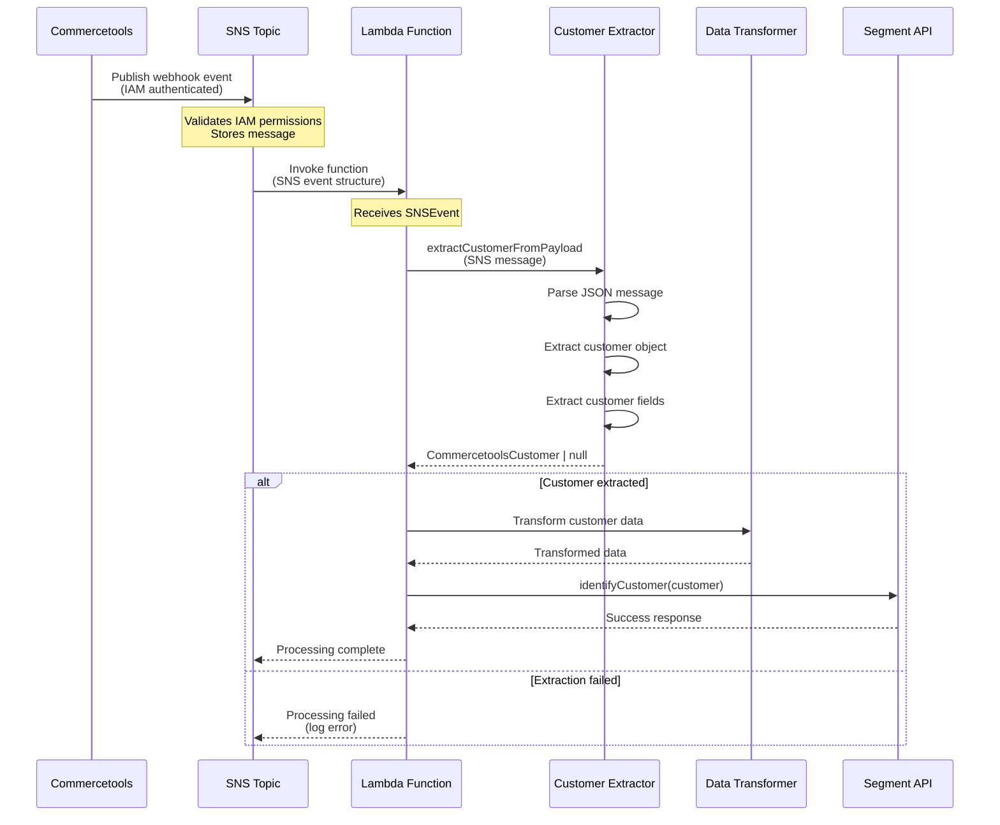

# STORY-19 Architectural Documentation and Data Flow

## Overview

Story-19 implements Lambda-SNS subscription integration, connecting Commercetools webhooks to AWS Lambda functions via AWS SNS. This document describes the architecture, component relationships, and data flow.

## Architecture Diagram

### High-Level Architecture

```
┌─────────────────┐
│ Commercetools   │
│   Platform      │
└────────┬────────┘
         │
         │ Publish (IAM)
         ▼
┌─────────────────┐
│   SNS Topic      │
│ (story-17)       │
└────────┬────────┘
         │
         │ Invoke (direct)
         ▼
┌─────────────────┐
│ Lambda Function │
│  (story-18)     │
└────────┬────────┘
         │
         │ API Call
         ▼
┌─────────────────┐
│  Segment API    │
└─────────────────┘
```

### Component Relationships

```
┌─────────────────────────────────────────────────────────────┐
│                    CDK Stack (CdkStack)                     │
│                                                              │
│  ┌──────────────┐      ┌──────────────┐                    │
│  │  SNS Topic   │──────│  Lambda      │                    │
│  │  (story-17)  │      │ Subscription │                    │
│  └──────┬───────┘      │  (story-19)  │                    │
│         │              └──────┬───────┘                    │
│         │                     │                            │
│         │ IAM Policy          │ IAM Permission             │
│         │ (sns:Publish)       │ (lambda:InvokeFunction)   │
│         │                     │                            │
└─────────┼─────────────────────┼──────────────────────────┘
          │                     │
          │                     │
          ▼                     ▼
    ┌──────────┐         ┌──────────┐
    │Commercetools│       │  Lambda  │
    │  IAM User  │       │ Function │
    └──────────┘         └──────────┘
```

## Data Flow

### Event Flow Sequence

```
1. Commercetools Event
   │
   ├─► CustomerCreated or CustomerUpdated
   │
   └─► Publish to SNS Topic (IAM authenticated)

2. SNS Topic Receives Event
   │
   ├─► Validates IAM permissions
   ├─► Stores message
   │
   └─► Invokes Lambda function (direct invocation)

3. Lambda Function Invoked
   │
   ├─► Receives SNS event structure
   ├─► Extracts message from event.Records[0].Sns.Message
   ├─► Parses JSON message
   │
   └─► Processes Commercetools payload

4. Customer Data Extraction
   │
   ├─► extractCustomerFromPayload(payload)
   ├─► Validates payload structure
   ├─► Extracts customer fields
   │
   └─► Returns CommercetoolsCustomer object

5. Data Transformation
   │
   ├─► Transform customer data (if needed)
   ├─► Validate data format
   │
   └─► Prepare for Segment API

6. Segment Integration
   │
   ├─► identifyCustomer(customer)
   ├─► Send to Segment API
   │
   └─► Return success/failure
```

### Detailed Data Flow Diagram



## Component Architecture

### CDK Stack Components

#### 1. SNS Topic (Story-17)

**Purpose:** Receive Commercetools webhook events

**Properties:**
- Name: `commercetools-webhook-{environment}`
- ARN: `arn:aws:sns:{region}:{account}:{topicName}`
- IAM Policy: Allows Commercetools IAM user to publish

**CloudFormation Resource:** `AWS::SNS::Topic`

#### 2. Lambda Subscription (Story-19)

**Purpose:** Connect SNS topic to Lambda function

**Properties:**
- Type: `LambdaSubscription`
- Protocol: Direct Lambda invocation
- Auto-grants IAM permissions

**CloudFormation Resource:** `AWS::SNS::Subscription`

#### 3. Lambda Function (Story-18)

**Purpose:** Process Commercetools events

**Properties:**
- Runtime: Node.js 20.x
- Handler: Processes SNS events
- Environment: Segment write key, etc.

**CloudFormation Resource:** `AWS::Lambda::Function`

#### 4. IAM Permissions

**SNS → Lambda:**
- Resource: `AWS::Lambda::Permission`
- Principal: `sns.amazonaws.com`
- Action: `lambda:InvokeFunction`
- Auto-granted by CDK

**Commercetools → SNS:**
- Resource: `AWS::SNS::TopicPolicy`
- Principal: Commercetools IAM user ARN
- Action: `sns:Publish`
- Manually configured in stack

### Lambda Function Components

#### 1. Event Handler

**Purpose:** Entry point for SNS events

**Input:** `SNSEvent` from AWS Lambda

**Output:** Processing results

#### 2. Customer Extractor

**Purpose:** Extract customer data from payloads

**Module:** `src/lambda/customer-extractor.ts`

**Function:** `extractCustomerFromPayload(payload: unknown): CommercetoolsCustomer | null`

**Behavior:**
- Validates payload structure
- Extracts customer object
- Extracts customer fields
- Handles missing/invalid fields

#### 3. Data Transformer

**Purpose:** Transform customer data for Segment

**Module:** `src/transformation/transformer.ts`

**Integration:** Used by Lambda handler

#### 4. Segment Integration

**Purpose:** Send customer data to Segment

**Module:** `src/integration/service.ts`

**Function:** `identifyCustomer(customer: CommercetoolsCustomer): Promise<void>`

## Event Structure

### SNS Event Structure

```typescript
interface SNSEvent {
  Records: Array<{
    EventSource: 'aws:sns';
    EventVersion: string;
    EventSubscriptionArn: string;
    Sns: {
      Type: 'Notification' | 'SubscriptionConfirmation';
      MessageId: string;
      TopicArn: string;
      Subject?: string;
      Message: string; // JSON string containing Commercetools payload
      Timestamp: string;
      SignatureVersion: string;
      Signature: string;
      SigningCertUrl: string;
      UnsubscribeUrl: string;
    };
  }>;
}
```

### Commercetools Payload Structure

```typescript
interface CommercetoolsPayload {
  notificationType: 'Message';
  type: 'CustomerCreated' | 'CustomerUpdated';
  customer: {
    email?: string;
    firstName?: string;
    lastName?: string;
    fullName?: string;
    addresses?: Array<{
      streetName?: string;
      streetNumber?: string;
      city?: string;
      postalCode?: string;
      country?: string;
    }>;
  };
}
```

### Customer Data Structure

```typescript
interface CommercetoolsCustomer {
  readonly email?: string | null;
  readonly firstName?: string | null;
  readonly lastName?: string | null;
  readonly fullName?: string | null;
  readonly addresses?: ReadonlyArray<{
    readonly streetName?: string | null;
    readonly streetNumber?: string | null;
    readonly city?: string | null;
    readonly postalCode?: string | null;
    readonly country?: string | null;
  }> | null;
}
```

## IAM Permissions Flow

### Permission Granting Sequence

```
1. CDK Stack Construction
   │
   ├─► Creates SNS Topic
   ├─► Creates Lambda Function (if provided)
   │
   └─► Creates Lambda Subscription

2. Lambda Subscription Creation
   │
   ├─► CDK automatically grants:
   │   ├─► SNS service principal → lambda:InvokeFunction
   │   └─► Lambda execution role → sns:Subscribe (if needed)
   │
   └─► Creates AWS::Lambda::Permission resource

3. SNS Topic Policy
   │
   ├─► Stack adds resource policy:
   │   ├─► Commercetools IAM user → sns:Publish
   │   └─► Scoped to topic ARN
   │
   └─► Creates AWS::SNS::TopicPolicy resource
```

### Permission Matrix

| Principal | Resource | Action | Granted By |
|-----------|----------|--------|------------|
| Commercetools IAM User | SNS Topic | `sns:Publish` | CDK Stack (manual) |
| SNS Service | Lambda Function | `lambda:InvokeFunction` | CDK (auto) |
| Lambda Execution Role | SNS Topic | `sns:Subscribe` | CDK (auto, if needed) |

## Integration Points

### Story Dependencies

```
Story-17: SNS Topic Creation
  │
  └─► Story-19: Lambda Subscription (depends on SNS Topic)

Story-18: Lambda Function Creation
  │
  └─► Story-19: Lambda Subscription (depends on Lambda Function)

Story-19: Lambda-SNS Integration
  │
  ├─► Uses: SNS Topic (from Story-17)
  ├─► Uses: Lambda Function (from Story-18)
  └─► Creates: Lambda Subscription
```

### Component Dependencies

```
CdkStack
  │
  ├─► Depends on: aws-cdk-lib/aws-sns.Topic
  ├─► Depends on: aws-cdk-lib/aws-sns-subscriptions.LambdaSubscription
  ├─► Depends on: aws-cdk-lib/aws-lambda.IFunction
  └─► Depends on: aws-cdk-lib/aws-iam.PolicyStatement

Lambda Function
  │
  ├─► Depends on: src/lambda/customer-extractor.ts
  ├─► Depends on: src/transformation/transformer.ts
  └─► Depends on: src/integration/service.ts
```

## Deployment Architecture

### Stack Deployment Order

```
1. Deploy Lambda Stack (Story-18)
   │
   └─► Creates Lambda Function

2. Deploy Main Stack (Story-17 + Story-19)
   │
   ├─► Creates SNS Topic (Story-17)
   ├─► Creates Lambda Subscription (Story-19)
   └─► Grants IAM Permissions

3. Configure Commercetools
   │
   └─► Create subscription pointing to SNS Topic ARN
```

### Cross-Stack Dependencies

When Lambda is in a separate stack:

```
LambdaStack
  │
  └─► Exports: Lambda Function ARN

MainStack
  │
  ├─► Imports: Lambda Function (from props)
  ├─► Creates: SNS Topic
  └─► Creates: Lambda Subscription
```

**Note:** Cross-stack Lambda references don't create stack outputs to avoid dependency cycles. In production, Lambda should be in the same stack.

## Error Handling Architecture

### Error Flow

```
1. SNS Event Processing Error
   │
   ├─► Lambda function throws error
   ├─► SNS retries (up to retry policy)
   │
   └─► Consider: Dead Letter Queue (future enhancement)

2. Customer Extraction Error
   │
   ├─► extractCustomerFromPayload returns null
   ├─► Lambda logs warning
   │
   └─► Continue to next record (don't fail entire batch)

3. Segment API Error
   │
   ├─► identifyCustomer throws error
   ├─► Lambda logs error
   │
   └─► Consider: Retry logic or DLQ
```

## Monitoring Architecture

### CloudWatch Metrics

- **SNS Metrics:**
  - NumberOfMessagesPublished
  - NumberOfMessagesDelivered
  - NumberOfNotificationsFailed

- **Lambda Metrics:**
  - Invocations
  - Errors
  - Duration
  - Throttles

### CloudWatch Logs

- **SNS Logs:** Delivery status
- **Lambda Logs:** Function execution logs

### Recommended Alarms

- Lambda error rate > threshold
- Lambda duration > timeout
- SNS delivery failures
- Lambda throttles

## Security Architecture

### Authentication

- **Commercetools → SNS:** IAM user authentication
- **SNS → Lambda:** Service-to-service (no authentication needed)

### Authorization

- **Least Privilege:** IAM permissions scoped to specific resources
- **Resource Policies:** SNS topic policy restricts publishers
- **Lambda Permissions:** Only SNS can invoke Lambda

### Data Protection

- **In Transit:** HTTPS for all API calls
- **At Rest:** CloudWatch Logs encryption
- **Secrets:** Environment variables for sensitive data (Segment write key)

## Scalability Architecture

### Auto-Scaling

- **SNS:** Automatically scales to handle message volume
- **Lambda:** Automatically scales based on SNS message rate
- **Concurrency:** Lambda concurrency limits apply

### Performance Considerations

- **Direct Invocation:** No HTTP overhead (faster than HTTP subscription)
- **Batch Processing:** Lambda can process multiple SNS records
- **Async Processing:** Non-blocking event processing

## Future Enhancements

### Potential Improvements

1. **Dead Letter Queue:** Add SQS DLQ for failed messages
2. **Retry Logic:** Implement exponential backoff retry
3. **Monitoring:** Enhanced CloudWatch dashboards
4. **Alerting:** SNS notifications for critical errors
5. **Multi-Region:** Support for multi-region deployments