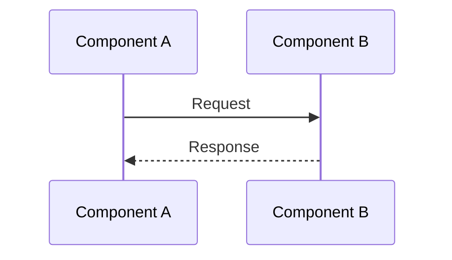

# STORY-19 Documentation Patterns and Standards

## Overview

This document establishes documentation patterns and standards for Story-19 and future stories. It defines templates, best practices, and conventions for creating comprehensive, maintainable documentation.

## Documentation Types

### 1. API Documentation (DOC/topic/api)

**Purpose:** Document public interfaces, methods, parameters, and return values

**Structure:**
```markdown
# Component Name API Documentation

## Overview
Brief description of the component and its purpose

## Public Interface

### Class/Function Name
Description

**Signature:**
```typescript
functionName(param: Type): ReturnType
```

**Parameters:**
- `param` (Type, required/optional): Description

**Returns:**
- `ReturnType`: Description

**Behavior:**
- What the function does
- Edge cases handled
- Error conditions

**Example:**
```typescript
// Usage example
```

## Type Definitions
Type definitions and interfaces

## Error Handling
Error conditions and handling

## Dependencies
External dependencies
```

**Tags:** `story-{id}`, `status/active`, `topic/api`, `component/{name}`

### 2. Usage Examples (DOC/topic/examples)

**Purpose:** Provide practical examples and integration patterns

**Structure:**
```markdown
# Component Name Usage Examples

## Overview
Brief description and use cases

## Table of Contents
1. Basic Usage
2. Advanced Patterns
3. Integration Examples
4. Testing Patterns

## Basic Usage
Simple examples

## Advanced Patterns
Complex scenarios

## Integration Examples
How to integrate with other components

## Best Practices
Recommended practices
```

**Tags:** `story-{id}`, `status/active`, `topic/examples`, `component/{name}`

### 3. Architectural Documentation (DOC/topic/architecture)

**Purpose:** Document architecture, component relationships, and data flow

**Structure:**
```markdown
# Component Name Architectural Documentation

## Overview
High-level architecture description

## Architecture Diagram
Mermaid diagrams or ASCII art

## Component Relationships
How components relate to each other

## Data Flow
How data flows through the system

## Event Structure
Event and data structures

## Integration Points
How components integrate

## Deployment Architecture
How components are deployed

## Security Architecture
Security considerations

## Scalability Architecture
Scalability considerations
```

**Tags:** `story-{id}`, `status/active`, `topic/architecture`, `component/{name}`

### 4. Troubleshooting Guides (DOC/topic/troubleshooting)

**Purpose:** Help diagnose and resolve common issues

**Structure:**
```markdown
# Component Name Troubleshooting Guide

## Overview
Brief description of troubleshooting approach

## Table of Contents
1. Issue Category 1
2. Issue Category 2
3. Debugging Techniques

## Issue Category 1

### Issue: Issue Name
**Symptoms:**
- Symptom 1
- Symptom 2

**Diagnosis:**
Steps to diagnose

**Solutions:**
1. Solution 1
2. Solution 2

## Debugging Techniques
Common debugging approaches

## Common Error Messages
Error messages and solutions
```

**Tags:** `story-{id}`, `status/active`, `topic/troubleshooting`, `component/{name}`

### 5. Documentation Patterns (DOC/topic/patterns)

**Purpose:** Document documentation standards and patterns

**Tags:** `story-{id}`, `status/active`, `topic/patterns`

## Documentation Standards

### Code Examples

**Format:**
- Use TypeScript for code examples
- Include type annotations
- Show complete, runnable examples when possible
- Include error handling in examples

**Example:**
```typescript
import { Component } from './component';

// Good: Complete example with error handling
async function example(): Promise<void> {
  try {
    const result = await component.process(data);
    console.log('Success:', result);
  } catch (error) {
    console.error('Error:', error);
    throw error;
  }
}
```

### Diagrams

**Format:**
- Use Mermaid diagrams for flow charts and sequence diagrams
- Use ASCII art for simple component diagrams
- Include descriptions for complex diagrams

**Example:**


### Type Definitions

**Format:**
- Always include TypeScript type definitions
- Use `readonly` for immutable properties
- Use `ReadonlyArray` for immutable arrays
- Document optional properties clearly

**Example:**
```typescript
interface Example {
  readonly required: string;
  readonly optional?: string;
  readonly items: ReadonlyArray<string>;
}
```

### Error Handling Documentation

**Format:**
- Document all error conditions
- Include error message formats
- Provide solutions for common errors
- Show error handling patterns

**Example:**
```markdown
## Error Handling

### Error: InvalidInput
**Cause:** Input doesn't match expected format
**Solution:** Validate input before processing
**Example:**
```typescript
if (!isValid(input)) {
  throw new Error('Invalid input');
}
```
```

## Documentation Tags

### Story Tags

- Format: `story-{id}` (e.g., `story-19`)
- Purpose: Link documentation to story/issue
- Required: Yes

### Status Tags

- Format: `status/{status}` (e.g., `status/active`, `status/deprecated`)
- Purpose: Indicate documentation status
- Required: Yes
- Values: `active`, `deprecated`, `archived`

### Topic Tags

- Format: `topic/{topic}` (e.g., `topic/api`, `topic/examples`)
- Purpose: Categorize documentation by topic
- Required: Yes
- Values: `api`, `examples`, `architecture`, `troubleshooting`, `patterns`

### Component Tags

- Format: `component/{name}` (e.g., `component/lambda`, `component/sns`)
- Purpose: Identify related components
- Required: Yes (at least one)
- Values: Component names (e.g., `lambda`, `sns`, `cdk`, `infrastructure`)

## Documentation Workflow

### Creating Documentation

1. **Gather Context:**
   - Read ARC memories for architecture
   - Read IMP memories for implementation details
   - Review code files and tests

2. **Identify Documentation Needs:**
   - API documentation for public interfaces
   - Usage examples for common patterns
   - Architectural documentation for system design
   - Troubleshooting guides for common issues

3. **Create Documentation:**
   - Follow structure templates
   - Include code examples
   - Add diagrams where helpful
   - Use proper tags

4. **Review Documentation:**
   - Verify accuracy
   - Check code examples work
   - Ensure completeness
   - Validate tags

### Updating Documentation

1. **Identify Changes:**
   - Code changes that affect API
   - New features requiring examples
   - Architecture changes
   - New error conditions

2. **Update Relevant Sections:**
   - Update API documentation for interface changes
   - Add examples for new features
   - Update architecture diagrams
   - Add troubleshooting for new issues

3. **Maintain Consistency:**
   - Follow same structure
   - Use same formatting
   - Keep tags consistent

## Documentation Quality Checklist

### Completeness

- [ ] All public interfaces documented
- [ ] All parameters and return values documented
- [ ] All error conditions documented
- [ ] Examples provided for common use cases
- [ ] Architecture diagrams included
- [ ] Troubleshooting guide covers common issues

### Accuracy

- [ ] Code examples are correct and runnable
- [ ] Type definitions match implementation
- [ ] Diagrams reflect actual architecture
- [ ] Error messages match actual errors
- [ ] Solutions actually work

### Clarity

- [ ] Clear explanations
- [ ] Well-organized structure
- [ ] Easy to find information
- [ ] Examples are understandable
- [ ] Diagrams are clear

### Consistency

- [ ] Follows documentation templates
- [ ] Uses consistent formatting
- [ ] Tags are consistent
- [ ] Terminology is consistent
- [ ] Code style matches project

## Documentation Templates

### API Documentation Template

```markdown
# {Component} API Documentation

## Overview
{Description}

## Public Interface

### {Function/Class Name}
{Description}

**Signature:**
```typescript
{signature}
```

**Parameters:**
- `{param}` ({Type}, {required/optional}): {Description}

**Returns:**
- {ReturnType}: {Description}

**Behavior:**
- {Behavior description}

**Example:**
```typescript
{example code}
```

## Type Definitions
{Type definitions}

## Error Handling
{Error handling}

## Dependencies
{Dependencies}
```

### Usage Examples Template

```markdown
# {Component} Usage Examples

## Overview
{Description}

## Table of Contents
1. {Section 1}
2. {Section 2}

## {Section 1}
{Content}

## Best Practices
{Practices}
```

### Architecture Documentation Template

```markdown
# {Component} Architectural Documentation

## Overview
{Description}

## Architecture Diagram
{Diagram}

## Component Relationships
{Relationships}

## Data Flow
{Data flow}

## Integration Points
{Integration}
```

### Troubleshooting Template

```markdown
# {Component} Troubleshooting Guide

## Overview
{Description}

## {Issue Category}

### Issue: {Issue Name}
**Symptoms:**
- {Symptom}

**Diagnosis:**
{Diagnosis}

**Solutions:**
1. {Solution}
```

## Best Practices

### Writing Documentation

1. **Start with Overview:**
   - Provide high-level context
   - Explain purpose and use cases
   - Set expectations

2. **Use Examples:**
   - Include practical examples
   - Show common use cases
   - Demonstrate best practices

3. **Be Complete:**
   - Document all public interfaces
   - Cover all error conditions
   - Include troubleshooting

4. **Keep Updated:**
   - Update when code changes
   - Remove outdated information
   - Add new examples as needed

### Code Examples

1. **Be Practical:**
   - Show real-world usage
   - Include error handling
   - Demonstrate best practices

2. **Be Complete:**
   - Include necessary imports
   - Show full function signatures
   - Include type annotations

3. **Be Clear:**
   - Use descriptive variable names
   - Add comments where helpful
   - Keep examples focused

### Diagrams

1. **Use Appropriate Format:**
   - Mermaid for flow charts
   - ASCII art for simple diagrams
   - Images for complex diagrams

2. **Keep Updated:**
   - Update when architecture changes
   - Reflect actual implementation
   - Remove outdated diagrams

## Documentation Maintenance

### Regular Reviews

- Review documentation quarterly
- Update for code changes
- Remove outdated content
- Add missing information

### Version Control

- Track documentation changes
- Link to code changes
- Maintain change history
- Tag documentation versions

### Feedback Integration

- Collect user feedback
- Update based on questions
- Improve unclear sections
- Add missing examples

## Tools and Resources

### Documentation Tools

- **Mermaid:** For diagrams
- **TypeScript:** For code examples
- **Markdown:** For documentation format
- **Memory Tools:** For storing documentation

### Resources

- [Mermaid Documentation](https://mermaid.js.org/)
- [TypeScript Handbook](https://www.typescriptlang.org/docs/)
- [Markdown Guide](https://www.markdownguide.org/)

## Conclusion

Following these patterns and standards ensures:
- Consistent documentation structure
- Comprehensive coverage
- Easy maintenance
- Better developer experience
- Improved code understanding