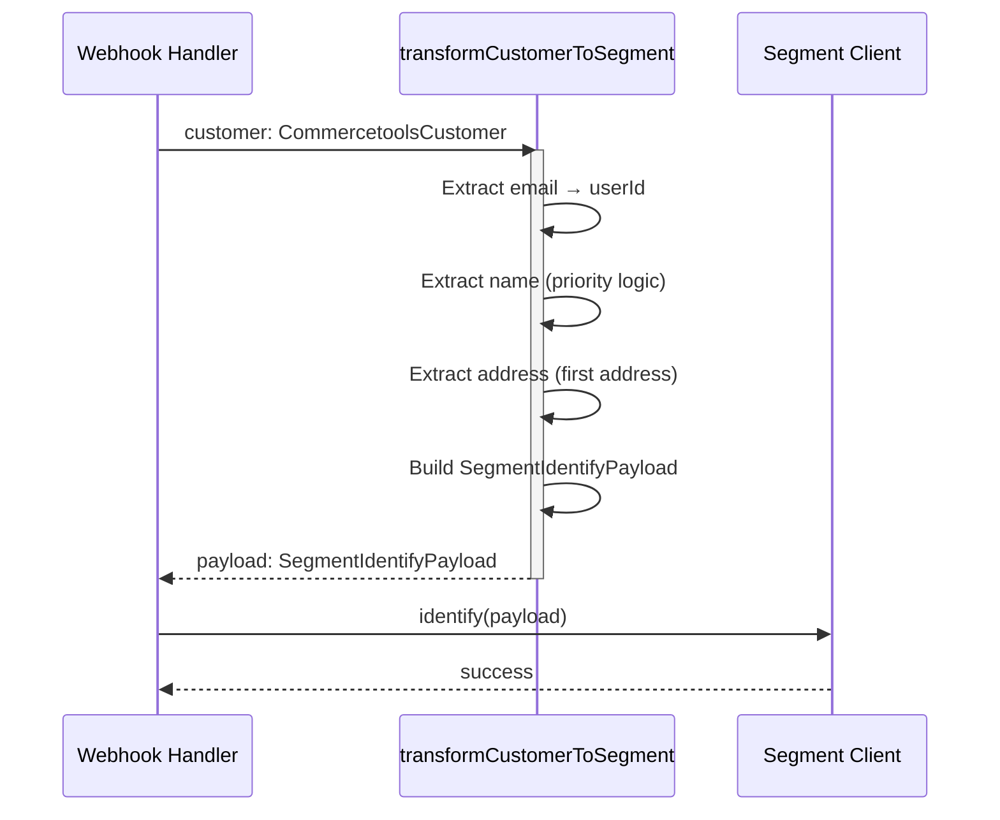
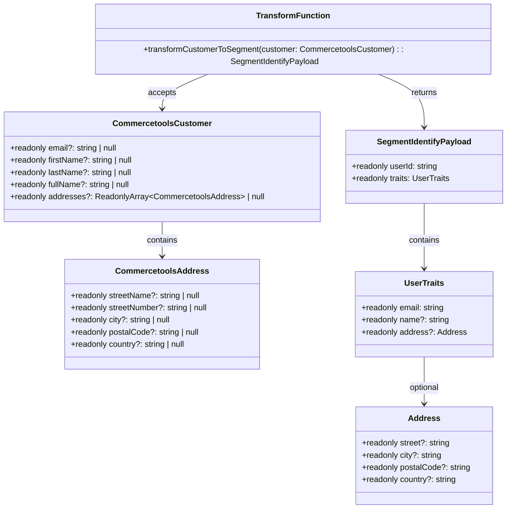

# STORY-3 Customer Data Transformation Architecture

## Component Overview

**Purpose:** Transform Commercetools customer resource data into Segment Identify API format

**Location:** `src/transformation/`

**Pattern:** Pure function transformation (no side effects, no I/O)

## Architecture Principles

### 1. Pure Function Design
- **No side effects:** Function does not modify external state
- **No I/O:** No network calls, file operations, or database access
- **Deterministic:** Same input always produces same output
- **Testable:** Easy to test in isolation without mocks

### 2. Immutability
- **Readonly inputs:** All input types use `readonly` modifiers
- **ReadonlyArray:** Uses `ReadonlyArray<T>` instead of `T[]`
- **Immutable outputs:** Return values are readonly and cannot be mutated

### 3. Graceful Degradation
- **Null safety:** Handles null/undefined values gracefully
- **Missing fields:** Omits missing fields from output instead of errors
- **Empty values:** Returns empty strings or undefined appropriately

## Component Structure

```
src/transformation/
├── types.ts          # Type definitions (CommercetoolsCustomer, CommercetoolsAddress, SegmentIdentifyPayload)
└── transformer.ts    # Main transformation function (transformCustomerToSegment)
```

## Data Flow

```
Commercetools Webhook
    ↓
CommercetoolsCustomer (input)
    ↓
transformCustomerToSegment()
    ↓
SegmentIdentifyPayload (output)
    ↓
Segment Client (identify)
```

## Field Transformation Logic

### Email Transformation
```
Input: customer.email (string | null | undefined)
Process:
  1. Trim whitespace
  2. Use empty string if null/undefined
Output: userId (string), traits.email (string)
```

### Name Transformation
```
Input: customer.fullName | customer.firstName + customer.lastName
Priority:
  1. fullName (if present and non-empty)
  2. firstName + lastName (if both present)
  3. firstName (if present)
  4. lastName (if present)
  5. undefined (if none present)
Output: traits.name (string | undefined)
```

### Address Transformation
```
Input: customer.addresses[0] (first address)
Process:
  1. Extract first address from array
  2. Combine streetName + streetNumber → street
  3. Extract city, postalCode, country
  4. Return undefined if all fields are null/empty
Output: traits.address (Address | undefined)
```

## Component Relationships

### Dependencies
- **Input:** Commercetools customer structure (from webhook payload)
- **Output:** `UserTraits` and `Address` from `src/segment/types.ts`
- **No external dependencies:** Pure TypeScript, no third-party libraries

### Integration Points
- **Webhook Handler:** Calls `transformCustomerToSegment()` with customer data
- **Segment Client:** Receives `SegmentIdentifyPayload` from transformation

## Design Decisions

### 1. Email Handling Strategy
**Decision:** Use empty string for missing email instead of throwing error

**Rationale:**
- Allows transformation to complete even without email
- Enables downstream systems to handle missing email appropriately
- Maintains type safety (userId is always string)

**Alternative Considered:** Throw error or return undefined
**Rejected Because:** Breaks graceful degradation principle

### 2. Name Priority
**Decision:** fullName > firstName+lastName > firstName > lastName

**Rationale:**
- fullName is most authoritative source
- firstName+lastName provides fallback
- Single name fields provide minimal fallback

### 3. Address Selection
**Decision:** Use first address from array

**Rationale:**
- Segment Identify API supports single address
- First address is typically primary/default
- Simple and predictable behavior

**Alternative Considered:** Allow multiple addresses
**Rejected Because:** Segment API limitation

### 4. Empty Address Handling
**Decision:** Return undefined if all address fields are null/empty

**Rationale:**
- Avoids sending empty address objects
- Cleaner output data
- Matches Segment API expectations

## Sequence Diagram



## Class Diagram



## Testing Strategy

### Unit Tests
- **Location:** `tests/transformation/transformer.test.ts`
- **Coverage:** 32 test cases covering all edge cases
- **Focus:** Individual field extraction, priority logic, null handling

### BDD Tests
- **Location:** `tests/steps/story-3-customer-data-transformation.steps.ts`
- **Scenarios:** 15 scenarios from feature file
- **Focus:** End-to-end transformation behavior

## Performance Considerations

- **Pure function:** No I/O, very fast execution
- **Immutable data:** No copying overhead (readonly types)
- **Simple logic:** Linear time complexity O(n) where n is number of address fields

## Security Considerations

- **Input sanitization:** All string inputs are trimmed
- **Type safety:** Full TypeScript type coverage prevents type errors
- **No code injection:** No dynamic code execution or template rendering